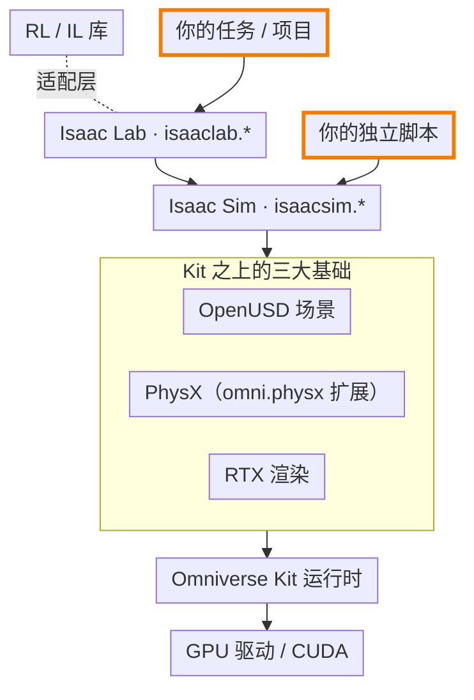
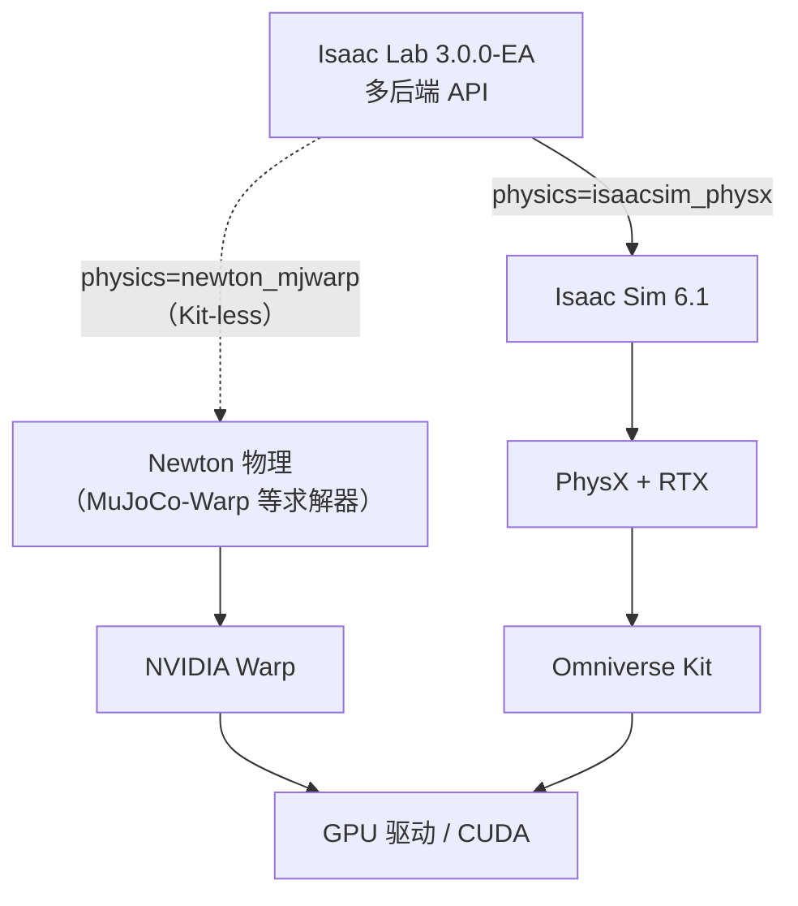

# 分层依赖图

!!! abstract "学习目标"
    读完本页你能：

    - 自底向上说出 Isaac 体系的六层，以及每层的角色
    - 说明每一层由谁维护、以什么形式分发
    - 解释为什么装错一个 Python 版本，整条链都用不了
    - 说出 Isaac Lab 3.0 的 Newton 路径绕开了哪几层

!!! info "前置知识"
    - 无。本页是全景地图的起点，只要求你用过 Python。

## 一张图看全栈

这一节回答：从显卡驱动到强化学习算法，中间隔着哪些层？

下图自底向上画出 Isaac 体系的主要层次。箭头表示"构建在……之上 / 运行在……之中"；橙色粗框是用户代码通常落在的位置。

*图 1：Isaac Sim 5.1.0 + Isaac Lab 2.3.2 的分层。箭头表示"构建在……之上 / 运行在……之中"：USD 与 RTX 是 Kit 的组成部分，PhysX 通过 `omni.physx` 扩展运行在 Kit 进程中。节点只写层名，每层的角色见下表。RL 库与 Isaac Lab 之间是虚线：两者互不依赖，由 Isaac Lab 的适配层（wrapper）把环境接到算法上；你的训练脚本通过这层适配调用 RL 库。*

逐层说明：

| 层 | 一句话角色 | 来源 |
|---|---|---|
| GPU 驱动 / CUDA | 物理、渲染、张量计算都跑在 GPU 上，驱动版本有推荐下限 | [^sim-req] [^lab-install] |
| Omniverse Kit | 构建 Omniverse 应用的 SDK，把 USD、RTX 渲染器、脚本、UI 等组件组织成一个可扩展的运行时 | [^kit] |
| OpenUSD / PhysX / RTX | USD 是 Kit 的主场景描述，RTX 是 Kit 的渲染器组件；PhysX 以 Kit 扩展（`omni.physx`）的形式在 Kit 进程内提供物理 | [^kit] [^sim-rn51] |
| Isaac Sim | 构建在 Omniverse 上的参考应用，由一组 `isaacsim.*` 扩展组成，提供 Python API、导入器、传感器、ROS 2 bridge | [^sim-index] [^rename] |
| Isaac Lab | 构建在 Isaac Sim 之上的机器人学习框架，负责环境抽象、并行化与任务定义 | [^lab-eco] |
| RL / IL 库 | 独立的第三方算法库，Isaac Lab 通过可选依赖和 wrapper 接入 | [^lab-rl-setup] [^lab-mimic-setup] |

两个用户落点的区别：做强化学习或模仿学习时，代码写在 Isaac Lab 之上（定义任务、调用 RL 库训练）；做数字孪生、合成数据或 ROS 联调时，常常直接写 Isaac Sim 的 standalone 脚本，完全不经过 Isaac Lab。

## 每层由谁维护、怎么分发

这一节回答：出了问题该去哪里查源码、提 issue？

| 层 | 维护方 | 许可与分发形式 | 来源 |
|---|---|---|---|
| Omniverse Kit SDK | NVIDIA | 不在 Isaac Sim 的开源仓库内，按 NVIDIA 专有许可分发；从源码构建 Isaac Sim 时自动下载 | [^sim-license] [^sim-readme] |
| OpenUSD | Pixar 发起的开源项目 | 开源，GitHub 分发；Kit 内置一份 USD 库 | [^usd] [^kit] |
| PhysX | NVIDIA | SDK 以 BSD-3 开源；Isaac Sim 通过 `omni.physx` 扩展使用 PhysX，该扩展单独发版（5.1.0 中为 107.3.26），针对特定 Kit 版本构建，随 Isaac Sim 一起分发 | [^physx] [^sim-rn51] |
| RTX 渲染 | NVIDIA | 作为 Kit 组件随 Kit 分发，不单独发布（推断：依据 Kit 组件列表与 Isaac Sim LICENSE 对附加组件的说明） | [^kit] [^sim-license] |
| Isaac Sim | NVIDIA | 应用本体源码以 Apache-2.0 在 GitHub 公开（自 v5.0.0 起有 tag）；二进制包、pip 包 `isaacsim`、容器镜像则按 NVIDIA 专有许可分发，与源码许可不同。运行它仍需要闭源的 Kit SDK 等组件 | [^sim-license] [^sim-pypi51] |
| Isaac Lab | NVIDIA 与社区 | BSD-3 开源，GitHub 分发 | [^lab-license] |
| RL / IL 库 | 各自的开源团队 | 各自开源、独立发版；Isaac Lab 在可选依赖里声明兼容版本，部分精确锁定（如 `rsl-rl-lib==3.1.2`、robomimic v0.4.0），部分只给下限（如 `skrl>=1.4.3`） | [^lab-rl-setup] [^lab-mimic-setup] |

!!! note "Isaac Sim 不是完全闭源"
    很多旧资料说 Isaac Sim 闭源。从 5.0 起，Isaac Sim 应用层代码已在 GitHub 以 Apache-2.0 公开，可以从源码构建[^sim-license]。闭源的是它依赖的 Kit SDK、RTX 等底层组件。注意源码许可只管 GitHub 上的代码：从 pip、容器或二进制包拿到的 Isaac Sim 仍按 NVIDIA 许可分发[^sim-pypi51]。

## 版本绑定链

这一节回答：为什么版本不能随便混搭？

链条自顶向下是这样的：

1. **Isaac Lab → Isaac Sim**：每个 Isaac Lab 版本声明它支持的 Isaac Sim 版本集合。2.3.x 支持 4.5 / 5.0 / 5.1[^lab-readme]，官方推荐 5.1.0[^lab-install]；3.0 只支持 6.1[^lab30-install]。
2. **Isaac Sim → Kit**：每个 Isaac Sim 版本固定一个 Kit SDK 版本。5.1.0 对应 Kit 107.3.3[^sim-rn51]，6.1.0 对应 Kit 110.3.0[^sim-rn61]。
3. **Kit → Python**：Kit 内嵌一个 Python 解释器，扩展里的编译模块按这个 Python 版本构建[^kit]。pip 包 `isaacsim` 5.1.0 要求 Python `==3.11.*`，6.1.0 要求 `==3.12.*`[^sim-pypi51][^sim-pypi61]。
4. **Isaac Lab → Python**：Isaac Lab 要和 Isaac Sim 装在同一个 Python 环境里，所以只能跟随 Isaac Sim 的 Python 版本。官方安装页明确写了 Isaac Sim 5.x 需要 Python 3.11[^lab-install]。

第 3 步是整条链里最硬的约束。Kit 扩展里有大量 C++ 编译模块，它们按特定 Python ABI 构建（推断：官方无明文说明。依据是 PyPI 上 `isaacsim` 的 `requires_python` 精确到小版本；Kit 手册有"Embedded Python"一节；本站在 5.1.0 pip 包中实测，扩展按 `cp311` ABI 编译，目录名形如 `omni.physx-107.3.26+107.3.3.lx64.r.cp311`，同时编码了 Kit 版本与 Python ABI）。换 Python 小版本不是"可能有兼容问题"，而是直接导入失败。

| 组合 | Isaac Lab | Isaac Sim | Kit SDK | Python | 其他 |
|---|---|---|---|---|---|
| 主线 | 2.3.2 | 5.1.0 | 107.3.3 | 3.11 | Linux 驱动推荐 ≥ 580.65.06[^lab-install] |
| 前沿 | 3.0.0-EA | 6.1（Isaac Sim 工作流） | 110.3.0 | 3.12 | PyTorch 2.11、Warp 1.16、Newton 1.5.2[^lab30-rn] |

*表：两条版本链。数字逐项来自对应版本的 release notes 与安装页，完整矩阵见 [1.1 版本兼容矩阵](../1-env/1.1-compat-matrix.md)。*

## 用分层图定位问题

这一节回答：这张图除了"知道"之外，平时怎么用？

遇到报错时，先判断它属于哪一层，再去对应的地方找答案。下面是按层归类的思路，具体报错索引见 [A.2 常见错误信息索引](../appendix/A.2-error-index.md)。

- **Python 导入就失败**（找不到 `isaacsim` 或 `isaaclab` 模块、C 扩展加载错误）：先查 Python 小版本是否与 Isaac Sim 要求一致，这是版本链里最硬的一环。
- **启动 Isaac Sim 时崩溃或黑屏**：多半在驱动 / Kit / RTX 这一段，先对照 Isaac Sim 的系统要求检查驱动版本[^sim-req]，而不是去翻 Isaac Lab 的代码。
- **机器人穿模、关节抖动、抓取打滑**：属于 PhysX 与 USD 物理属性这一层，要调的是碰撞体、关节驱动参数，见 [3.3 PhysX 物理：刚体与碰撞](../3-isaacsim/3.3-rigid-collision.md) 与 [3.4 关节与 Articulation](../3-isaacsim/3.4-articulation.md)。
- **训练曲线不涨、奖励异常**：落在 Isaac Lab 任务定义与 RL 库这两层，与仿真器本身基本无关，见 [5.8 训练不收敛时看什么](../5-rl/5.8-training-debug.md)。

查资料时也按层找：Kit、USD、PhysX 的问题去 Omniverse 文档；Isaac Sim 的扩展与 API 去 Isaac Sim 文档与源码；任务、Manager、训练脚本去 Isaac Lab 文档与源码。搜到的旧帖子先看它讲的是哪一层、哪个版本，再决定能不能照搬。

## 3.0 的变化：绕开 Kit 的路径

这一节回答：Isaac Lab 3.0 把这张图改成了什么样？

!!! warning "3.0.0-EA，可能变动"
    以下内容基于 Isaac Lab v3.0.0-EA（2026-09 发布）。官方计划 2026 年 10 月底发布 GA，EA 到 GA 之间只做缺陷修复与稳定性改进[^lab30-rn]。

3.0 引入了"工厂式多后端"架构：同一套资产、传感器、场景 API，在启动时通过 `physics=`、`renderer=` 选择具体实现[^lab30-rn]。其中最大的变化是 **Kit-less 执行**：很多工作流可以不安装、不启动 Isaac Sim[^lab30-rn]。

*图 2：Isaac Lab 3.0 的两条物理路径。实线经过 Isaac Sim、Kit、PhysX，是 2.x 的老路；虚线直接走 Newton 与 Warp，不经过 Kit。Newton 构建在 Warp 之上[^newton]。*

需要注意三点：

- Kit-less 不等于"只能用 Newton"。3.0 还提供 OVPhysX、OVRTX 两个可选运行时，同样不启动 Isaac Sim[^lab30-rn]。图 2 为简洁只画了 Newton。
- XR 遥操作、Isaac Sim 的 PhysX 与 RTX、ROS bridge、livestream 这些能力仍需要完整的 Isaac Sim[^lab30-rn]。
- 3.0 有大量破坏性变更，例如四元数顺序从 WXYZ 改为 XYZW、`.data.*` 属性不再直接返回 `torch.Tensor`[^lab30-rn]。本站主线仍用 2.3.2，3.0 的动机与细节见 [8.1 3.0 改了什么、为什么改](../8-frontier/8.1-what-changed.md)。

## 常见误解

!!! warning "误解一：Isaac Lab 是 Isaac Sim 的一个模块"
    不是。Isaac Lab 是独立仓库、独立发版、独立许可（BSD-3）的框架，构建在 Isaac Sim 之上[^lab-eco][^lab-license]。Isaac Sim 的扩展命名空间是 `isaacsim.*`，Isaac Lab 是 `isaaclab.*`。两者的边界详见 [0.5 Isaac Sim 与 Isaac Lab 的边界](0.5-sim-lab-boundary.md)。

!!! warning "误解二：装了 Isaac Sim 就有 Isaac Lab"
    Isaac Sim 不自带 Isaac Lab。官方安装指南要求先装 Isaac Sim，再单独安装 Isaac Lab，并且两者必须在同一个 Python 版本下[^lab-install]。反过来，3.0 的 Kit-less 工作流可以只装 Isaac Lab 不装 Isaac Sim[^lab30-rn]。

!!! warning "误解三：Isaac Gym 和 Isaac Sim 是同一个东西的新旧版本"
    不是。Isaac Gym 是一个独立的预览版 GPU 物理仿真工具，直接构建在 PhysX 上，不支持可变形体与刚体的交互，没有高保真渲染和 ROS 支持；NVIDIA 后来把它的能力整合进了 Isaac Sim；基于它的任务库 IsaacGymEnvs 则由 Isaac Lab 取代[^lab-eco]。改名史详见 [0.3 产品谱系与改名史](0.3-lineage.md)。

!!! warning "误解四：Isaac ROS 就是 Isaac Sim 的 ROS 接口"
    Isaac Sim 的 ROS 2 bridge 是仿真器里的一个扩展；Isaac ROS 是跑在真机上的硬件加速 ROS 2 软件包集合，不在本页的分层图里[^sim-index]。详见 [0.4 名字带 Isaac 但不是一回事](0.4-isaac-names.md)。

## 延伸阅读

- 官方文档：
    - [Isaac Sim 5.1.0 文档首页](https://docs.isaacsim.omniverse.nvidia.com/5.1.0/index.html)（Isaac Sim 的定位与能力概览）
    - [Isaac Sim 5.1.0 Release Notes](https://docs.isaacsim.omniverse.nvidia.com/5.1.0/overview/release_notes.html)（Kit 版本与依赖扩展版本）
    - [Isaac Lab 2.3.2 生态说明](https://isaac-sim.github.io/IsaacLab/v2.3.2/source/setup/ecosystem.html)（Isaac Lab、Isaac Sim、Isaac Gym 的关系）
    - [Isaac Lab 2.3.2 安装要求](https://isaac-sim.github.io/IsaacLab/v2.3.2/source/setup/installation/index.html)
    - [Isaac Lab v3.0.0-EA Release](https://github.com/isaac-sim/IsaacLab/releases/tag/v3.0.0-EA) 与 [3.0 安装文档](https://isaac-sim.github.io/IsaacLab/release/3.0.0/source/setup/installation/index.html)
    - [Omniverse Kit Overview](https://docs.omniverse.nvidia.com/kit/docs/kit-manual/latest/guide/kit_overview.html)（Kit 由哪些组件构成）
- 源码：
    - [isaac-sim/IsaacSim @ v5.1.0](https://github.com/isaac-sim/IsaacSim/tree/v5.1.0)
    - [isaac-sim/IsaacLab @ v2.3.2](https://github.com/isaac-sim/IsaacLab/tree/v2.3.2)
- 中文翻译（中文翻译站，译自最新版 Isaac Sim 文档，与主线 5.1.0 可能有差异）：
    - [Isaac Sim 文档首页](https://isaac.kiloong.com/zh/index.html)
    - [Release Notes](https://isaac.kiloong.com/zh/overview/release_notes.html)
    - [系统要求](https://isaac.kiloong.com/zh/installation/requirements.html)
    - [扩展改名对照](https://isaac.kiloong.com/zh/migration_guides/isaac_sim_4_5/extensions_renaming.html)

## 版本说明

- **Isaac Sim 4.x**：需要 Python 3.10[^lab-install]。扩展从 4.5 起由 `omni.isaac.*` 改名为 `isaacsim.*`[^rename]。5.x 中旧名仍以弃用扩展的形式保留，官方计划在 6.0 完全移除[^sim-rn51]。所以旧导入路径通常仍可用（本站实测 `omni.isaac.core`），但会打印弃用警告，应按改名表迁移。
- **Isaac Lab 2.x 各小版本**：支持的 Isaac Sim 集合不同，2.0/2.1 只支持 4.5，2.2 支持 4.5/5.0[^lab-readme]。
- **Isaac Lab 3.0**：Isaac Sim 变为可选依赖，新增 Kit-less 路径，不支持 Isaac Sim 5.1 及更早版本[^lab30-install]。见 [8.1 3.0 改了什么、为什么改](../8-frontier/8.1-what-changed.md)。

[^sim-req]: Isaac Sim 5.1.0 Requirements：<https://docs.isaacsim.omniverse.nvidia.com/5.1.0/installation/requirements.html>（已测试的驱动版本 Linux 580.65.06 / Windows 580.88）
[^kit]: Omniverse Kit Manual, Kit Overview：<https://docs.omniverse.nvidia.com/kit/docs/kit-manual/latest/guide/kit_overview.html>（Kit 是构建 Omniverse 应用的 SDK；USD 为主场景描述；组件含 RTX Renderer 与 Scripting；手册另有 Embedded Python 章节）
[^sim-rn51]: Isaac Sim 5.1.0 Release Notes：<https://docs.isaacsim.omniverse.nvidia.com/5.1.0/overview/release_notes.html>（General 节：更新到 Kit 107.3.3，所有弃用扩展将在下一个大版本 6.0 中完全移除；Kit SDK Version 节：107.3.1 → 107.3.3；Dependencies 节：`omni.physx` 107.3.18 → 107.3.26）
[^sim-rn61]: Isaac Sim 6.1.0 Release Notes：<https://docs.isaacsim.omniverse.nvidia.com/6.1.0/overview/release_notes.html>（6.1.0 GA 的 General 节：更新到 Kit SDK 110.3.0；Kit SDK version 节：110.1.2 → 110.3.0）
[^sim-index]: Isaac Sim 5.1.0 文档首页：<https://docs.isaacsim.omniverse.nvidia.com/5.1.0/index.html>（Isaac Sim 是构建在 Omniverse 上的参考应用；USD 是核心数据交换格式；PhysX 与 RTX；ROS 2 bridge 与 Isaac ROS 的区分）
[^rename]: Isaac Sim 5.1.0 Extensions Renaming：<https://docs.isaacsim.omniverse.nvidia.com/5.1.0/overview/extensions_renaming.html>（4.5 起改名的对照表；页面中 5.0 移除的计划已被 5.1.0 Release Notes 更新为 6.0 移除）
[^sim-license]: Isaac Sim 源码仓库 LICENSE（tag v5.1.0）：<https://github.com/isaac-sim/IsaacSim/blob/v5.1.0/LICENSE>（仓库内软件为 Apache 2.0；构建或使用需要按其他条款授权的组件，包括 Omniverse Kit SDK）
[^sim-pypi51]: PyPI `isaacsim` 5.1.0.0：<https://pypi.org/project/isaacsim/5.1.0.0/>（Requires: Python ==3.11.*；License 字段为 NVIDIA Proprietary Software）
[^sim-pypi61]: PyPI `isaacsim` 6.1.0.0：<https://pypi.org/project/isaacsim/6.1.0.0/>（Requires: Python ==3.12.*）
[^sim-readme]: Isaac Sim 源码仓库 README（tag v5.1.0）：<https://github.com/isaac-sim/IsaacSim/blob/v5.1.0/README.md>（从源码构建需要联网下载 Omniverse Kit SDK）
[^newton]: Newton 仓库 README：<https://github.com/newton-physics/newton>（Newton 是构建在 NVIDIA Warp 之上的 GPU 物理引擎，以 MuJoCo Warp 为主要后端）
[^usd]: OpenUSD 仓库：<https://github.com/PixarAnimationStudios/OpenUSD>
[^physx]: NVIDIA PhysX 仓库：<https://github.com/NVIDIA-Omniverse/PhysX>（README 中的 BSD-3 许可）
[^lab-eco]: Isaac Lab 2.3.2, Isaac Lab Ecosystem：<https://isaac-sim.github.io/IsaacLab/v2.3.2/source/setup/ecosystem.html>
[^lab-license]: Isaac Lab LICENSE（tag v2.3.2）：<https://github.com/isaac-sim/IsaacLab/blob/v2.3.2/LICENSE>（SPDX: BSD-3-Clause）
[^lab-install]: Isaac Lab 2.3.2 Local Installation：<https://isaac-sim.github.io/IsaacLab/v2.3.2/source/setup/installation/index.html>（先装 Isaac Sim 再装 Isaac Lab；推荐 Isaac Sim 5.1.0；5.X 需要 Python 3.11，4.X 需要 3.10；Linux 推荐驱动 580.65.06 或更新）
[^lab-readme]: Isaac Lab README（tag v2.3.2），Isaac Sim Version Dependency 一节：<https://github.com/isaac-sim/IsaacLab/blob/v2.3.2/README.md#isaac-sim-version-dependency>
[^lab-rl-setup]: `isaaclab_rl` 的可选依赖（tag v2.3.2）：<https://github.com/isaac-sim/IsaacLab/blob/v2.3.2/source/isaaclab_rl/setup.py>（sb3、skrl、rl-games、rsl-rl）
[^lab-mimic-setup]: `isaaclab_mimic` 的可选依赖（tag v2.3.2）：<https://github.com/isaac-sim/IsaacLab/blob/v2.3.2/source/isaaclab_mimic/setup.py>（robomimic）
[^lab30-rn]: Isaac Lab v3.0.0-EA Release Notes：<https://github.com/isaac-sim/IsaacLab/releases/tag/v3.0.0-EA>
[^lab30-install]: Isaac Lab 3.0 Installation：<https://isaac-sim.github.io/IsaacLab/release/3.0.0/source/setup/installation/index.html>（完整 Isaac Sim 工作流需要 Python 3.12；不支持 Isaac Sim 5.1 及更早版本）
