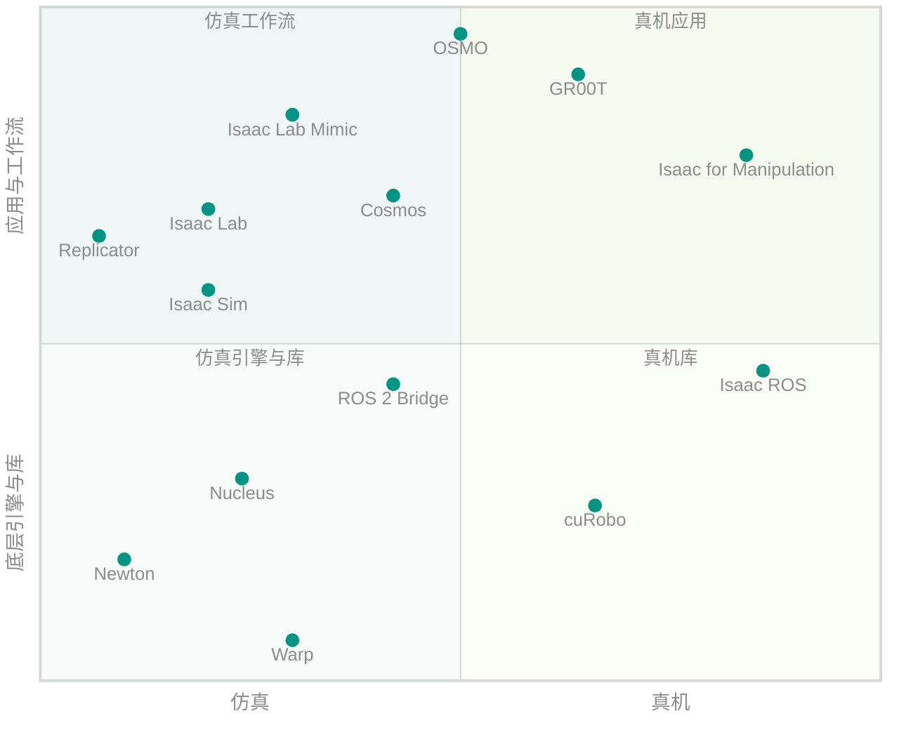

# 名字带 Isaac 但不是一回事

!!! abstract "学习目标"
    读完本页你能：

    - 说出 NVIDIA 机器人产品线里十几个名字各自是什么、跑在哪里
    - 区分 Isaac ROS 与 Isaac Sim 的 ROS 2 Bridge、Isaac Lab 与 Isaac Lab Mimic 与 GR00T、Newton 与 PhysX
    - 按自己的目标判断：学本站内容时哪些必须装，哪些可以先不管

!!! info "前置知识"
    - [0.2 分层依赖图](0.2-layers.md)：Isaac Sim 与 Isaac Lab 的位置
    - [0.3 产品谱系与改名史](0.3-lineage.md)：已废弃的旧名字

## 一张定位图

这一节回答：这些产品大致落在哪里？

下图横轴从"仿真"到"真机"，纵轴从"底层引擎、库"到"应用、工作流"。点的位置是示意，用来建立直觉，不是精确度量。

*图 1：NVIDIA 机器人相关产品的定位示意。左下是仿真用的引擎与库，左上是仿真里的工作流，右侧是跑在真机上的软件。GR00T、Cosmos、OSMO 横跨仿真与真机，放在中间。*

## 逐项说明

这一节回答：每个名字是什么、和 Isaac Sim / Isaac Lab 什么关系、本站会不会讲？

| 名称 | 一句话定义 | 运行位置 | 与 Isaac Sim / Lab 的关系 | 开源 | 本站 | 来源 |
|---|---|---|---|---|---|---|
| Isaac ROS | NVIDIA 加速的 ROS 2 软件包集合，面向 Jetson 等平台上的自主机器人；当前版本 5.0.0（2026-09） | 真机（Jetson、x86 + GPU） | 独立产品；可以用 Isaac Sim 做仿真测试，但不依赖 Isaac Sim | 以 NVIDIA Isaac ROS 软件许可发布（非 OSI 开源许可） | 只在 [3.10](../3-isaacsim/3.10-ros2-bridge.md) 讲边界 | [^iros] [^iros-lic] |
| Isaac for Manipulation / Isaac for Mobility | Isaac ROS 的参考工作流。前者原名 Isaac Manipulator（4.0.0 起改名）；当前文档的参考工作流目录列出的是 Isaac for Mobility，原 Isaac Perceptor 的文档地址已失效 | 真机 | 同上 | 同上 | 不涉及 | [^iros-rn] [^iros-rw] |
| Isaac Sim ROS 2 Bridge | Isaac Sim 的一个扩展，把仿真里的传感器、TF、时钟等发布成 ROS 2 话题 | 仿真（Isaac Sim 进程内） | Isaac Sim 的组成部分 | 随 Isaac Sim 源码（Apache-2.0） | [3.10](../3-isaacsim/3.10-ros2-bridge.md) | [^ros2] [^sim-index] |
| Isaac Lab Mimic | Isaac Lab 自带的示教数据生成扩展：从少量人工示教自动生成更多轨迹，基于 MimicGen | 仿真 | Isaac Lab 的一个包（`isaaclab_mimic`） | 随 Isaac Lab（BSD-3） | [4.19](../4-isaaclab/4.19-mimic.md)、[6.4.7](../6-galbot/4-task/6.4.7-mimic.md) | [^lab-v2] [^mimic] |
| Isaac GR00T | 面向通用人形机器人的开放参考平台，核心是开放的机器人基础模型（当前 N1.7），并包括数据管线、仿真框架、中间件与 Jetson Thor 推理 | 训练在数据中心，推理在真机 | 平台中的仿真部分使用 Isaac Lab 训练、Isaac Sim 验证；模型本身不依赖 Isaac Lab | 模型代码 Apache-2.0 | 不涉及 | [^gr00t] [^gr00t-gh] |
| Replicator | Omniverse 的合成数据生成框架，在 Isaac Sim 中用于随机化场景与输出标注 | 仿真（Isaac Sim 进程内） | Isaac Sim 提供；Isaac Lab 的相机基于它的 annotator | 随 Kit 分发（推断：与 RTX 等组件相同） | [3.9](../3-isaacsim/3.9-replicator.md) | [^repl] [^camera] |
| Newton | 构建在 Warp 之上的开源 GPU 物理引擎，以 MuJoCo Warp 为主要后端；由 Disney Research、Google DeepMind 与 NVIDIA 发起，Linux Foundation 项目 | 仿真 | Isaac Lab 3.0 的可选物理后端；2.3.2 不使用 | Apache-2.0 | [8.3](../8-frontier/8.3-newton.md) | [^newton] [^lf] [^lab30] |
| Warp | 把 Python 函数 JIT 编译成 CPU / GPU 内核的框架，用于仿真、机器人与机器学习 | 仿真 / 通用 GPU 计算 | Isaac Lab 2.3.2 已用它实现部分功能（如射线传感器）；3.0 的数据路径以它为主 | Apache-2.0 | 按需提及 | [^warp] [^raycaster] |
| cuRobo | CUDA 加速的机器人运动生成库：碰撞检测、逆运动学、轨迹优化 | 真机与仿真均可 | 独立库；Isaac ROS 的 cuMotion 基于它（推断：依据 Isaac ROS 文档中 cuMotion 的命名与定位） | Apache-2.0 | 不涉及 | [^curobo] [^iros-man] |
| Cosmos | 物理 AI 的世界基础模型平台，用于生成大规模逼真数据，服务于模型训练与仿真 | 数据中心 | 独立平台；GR00T N1.7 的视觉语言骨干来自 Cosmos-Reason2 | 平台仓库为 OpenMDW-1.1 许可 | 不涉及 | [^cosmos] [^cosmos-gh] [^gr00t-gh] |
| Omniverse Nucleus | Omniverse 的数据库与协作服务 | 服务器 | Isaac Sim 5.1 的默认资产根目录是公网云存储地址，Nucleus 变为可选；也可下载资产包到本地 | 专有 | [2.8](../2-usd-kit/2.8-nucleus.md) | [^nucleus] [^faq] |
| OSMO | 开源的物理 AI 工作负载编排平台，用一个 YAML 把训练集群、仿真与边缘环境统一调度 | 云与本地集群 | 可以编排 Isaac Sim / Isaac Lab 任务，但不是它们的组成部分 | Apache-2.0 | 不涉及 | [^osmo] [^osmo-gh] |

## 三个最常见的混淆

!!! warning "混淆一：Isaac ROS 和 Isaac Sim 的 ROS 2 Bridge"
    ROS 2 Bridge 是 **Isaac Sim 里的一个扩展**，作用是让仿真器"说 ROS 2"，把仿真相机、激光雷达、TF 发成话题[^ros2]。Isaac ROS 是 **跑在真机上的一整套加速 ROS 2 软件包**，做感知、定位、运动规划[^iros]。两者可以配合（用 Isaac Sim 通过 Bridge 给 Isaac ROS 喂仿真数据），但装了其中一个不会得到另一个。

!!! warning "混淆二：Isaac Lab、Isaac Lab Mimic 和 GR00T"
    Isaac Lab 是训练框架；Isaac Lab Mimic 是 Isaac Lab 里专门**扩增示教数据**的一个包[^lab-v2]；GR00T 是一个**预训练好的人形机器人基础模型及其配套平台**，它的训练与验证会用到 Isaac Lab 和 Isaac Sim，但它本身是模型，不是框架[^gr00t]。本站用 Mimic 做 pick-and-place 的数据扩增，不讲 GR00T。

!!! warning "混淆三：Newton 和 PhysX"
    PhysX 是 Isaac Sim 与 Isaac Lab 2.x 使用的物理引擎，通过 Kit 的 `omni.physx` 扩展运行[^sim-index]。Newton 是另一个独立的开源物理引擎，构建在 Warp 上，由 Linux Foundation 托管[^newton]。Isaac Lab 3.0 把两者都做成可选后端，用 `physics=` 选择[^lab30]。Newton 不是 PhysX 的新版本，两者的求解器与参数含义也不同。

## 遇到新名字怎么归类

这一节回答：以后再冒出一个带 Isaac 的新名字，怎么自己判断它的位置？

NVIDIA 的机器人产品更新很快，本页的表迟早会过时。与其背表，不如掌握一个三问法，每一问都能在官方页面上找到答案：

1. **它跑在哪个进程里？** 如果文档说它是 Isaac Sim 或 Kit 的"扩展"（extension），它就在仿真器进程内，比如 ROS 2 Bridge、Replicator；如果文档讲的是 Jetson、JetPack、ROS 2 launch，它就跑在真机上，比如 Isaac ROS；如果讲的是集群、YAML、调度，它就在云或数据中心，比如 OSMO。
2. **它是库、框架、模型还是平台？** 库被别人调用（Warp、cuRobo）；框架规定你怎么组织代码（Isaac Lab）；模型是训练好的权重（GR00T N1.7）；平台把前面几样打包成一条工作流（GR00T 平台、Cosmos）。名字相近的东西常常分属不同类别，比如 "Isaac GR00T" 既指平台，也指其中的模型。
3. **它的许可是什么？** 看 GitHub 仓库的 LICENSE 文件。Apache-2.0、BSD-3 可以放心阅读和修改源码；NVIDIA 自有许可（如 Isaac ROS 的软件许可）要读条款；没有公开仓库的就是专有软件。

另外要记住：**"Isaac" 是品牌前缀，不代表依赖关系**。Isaac ROS 不依赖 Isaac Sim，GR00T 模型不依赖 Isaac Lab，Newton 也不属于 Isaac 品牌，却是 Isaac Lab 3.0 的后端。判断关系时看文档里的"depends on / built on / integrates with"，不要看名字。

## 我需要哪些

这一节回答：按我的目标，哪些必须装、哪些可选？

| 目标 | 必需 | 可选 | 暂时不用管 |
|---|---|---|---|
| 训练强化学习策略（本站主线） | Isaac Sim、Isaac Lab、一个 RL 库（如 rsl_rl） | Newton（仅 3.0） | Isaac ROS、GR00T、Cosmos、OSMO |
| 模仿学习 | Isaac Sim、Isaac Lab、Isaac Lab Mimic | 遥操作设备 | GR00T（除非直接微调基础模型） |
| 数字孪生与 ROS 联调 | Isaac Sim、ROS 2 Bridge | Nucleus（团队共享资产时） | Isaac Lab |
| 合成数据 | Isaac Sim、Replicator | Cosmos | Isaac Lab |
| 真机部署 | 你的机器人软件栈 | Isaac ROS、cuRobo | Replicator |

说明：Warp 没有单列，因为它是 Isaac Lab 的必需依赖（`setup.py` 中的 `warp-lang`），安装 Isaac Lab 时会自动装上[^lab-setup]。表中"必需"指按官方文档的常规做法所需的组件，依据是各产品页对自身定位的描述（见上表来源）；具体到某个项目，仍要看你的技术选型。

## 延伸阅读

- 官方首页：[Isaac ROS](https://nvidia-isaac-ros.github.io/)、[Isaac GR00T](https://developer.nvidia.com/isaac/gr00t)、[Cosmos](https://developer.nvidia.com/cosmos)、[OSMO](https://developer.nvidia.com/osmo)、[Newton](https://newton-physics.github.io/newton/)、[Warp](https://nvidia.github.io/warp/)、[cuRobo](https://curobo.org/)
- Isaac Sim 5.1.0：[ROS 2 教程入口](https://docs.isaacsim.omniverse.nvidia.com/5.1.0/ros2_tutorials/ros2_landing_page.html)、[合成数据](https://docs.isaacsim.omniverse.nvidia.com/5.1.0/replicator_tutorials/index.html)
- Isaac Lab 2.3.2：[Teleoperation and Imitation Learning with Isaac Lab Mimic](https://isaac-sim.github.io/IsaacLab/v2.3.2/source/overview/imitation-learning/teleop_imitation.html)
- 中文翻译（中文翻译站，译自最新版 Isaac Sim 文档，与主线 5.1.0 可能有差异）：[Isaac Sim 文档首页](https://isaac.kiloong.com/zh/index.html)

## 版本说明

- 本页产品状态按 2026-09-30 的官方页面整理。这些产品各自独立发版、改名频繁（例如 Isaac Manipulator 在 Isaac ROS 4.0.0 中改名为 Isaac for Manipulation[^iros-rn]），引用前请回到官方页面确认。
- **Isaac Lab 3.0.0-EA**：Newton 与 OVPhysX 成为可选物理后端，Warp 成为主要数据路径；Isaac Sim 变为可选依赖[^lab30]。见 [8.1 3.0 改了什么、为什么改](../8-frontier/8.1-what-changed.md)。

[^iros]: Isaac ROS 文档首页：<https://nvidia-isaac-ros.github.io/index.html>（NVIDIA 加速的 ROS 2 软件包集合，面向 Jetson 等 NVIDIA 平台上的自主机器人）
[^iros-lic]: `NVIDIA-ISAAC-ROS/isaac_ros_common` LICENSE：<https://github.com/NVIDIA-ISAAC-ROS/isaac_ros_common/blob/main/LICENSE>（NVIDIA ISAAC ROS SOFTWARE LICENSE）
[^iros-rn]: Isaac ROS Release Notes：<https://nvidia-isaac-ros.github.io/releases/index.html>（5.0.0 于 2026-09-21 发布；4.0.0 注明 Isaac for Manipulation 原名 Isaac Manipulator；4.4.0 中 `isaac_manipulator` 仓库改名为 `isaac_ros_manipulation`）
[^iros-rw]: Isaac ROS Reference Workflows：<https://nvidia-isaac-ros.github.io/reference_workflows/index.html>（当前只列出 Isaac for Mobility；`isaac_perceptor` 仓库 README 指向的 `reference_workflows/isaac_perceptor/` 地址返回 404）
[^iros-man]: Isaac ROS Manipulation 概念页：<https://nvidia-isaac-ros.github.io/concepts/manipulation/index.html>（cuMotion 与 MoveIt 插件）
[^ros2]: Isaac Sim 5.1.0：ROS 2 教程入口：<https://docs.isaacsim.omniverse.nvidia.com/5.1.0/ros2_tutorials/ros2_landing_page.html>
[^sim-index]: Isaac Sim 5.1.0 文档首页：<https://docs.isaacsim.omniverse.nvidia.com/5.1.0/index.html>（ROS 2 bridge API 与 Isaac ROS 的区分；GPU PhysX）
[^lab-v2]: Isaac Lab v2.0.0 Release：<https://github.com/isaac-sim/IsaacLab/releases/tag/v2.0.0>（Isaac Lab Mimic 从少量人工示教自动生成更多轨迹，基于 MimicGen）
[^mimic]: Isaac Lab 2.3.2：Teleoperation and Imitation Learning with Isaac Lab Mimic：<https://isaac-sim.github.io/IsaacLab/v2.3.2/source/overview/imitation-learning/teleop_imitation.html>（`isaaclab_mimic` 包；目前仅支持 Linux）
[^gr00t]: NVIDIA Developer：Isaac GR00T：<https://developer.nvidia.com/isaac/gr00t>（开放参考平台，包括数据管线、机器人基础模型、仿真框架、中间件与 Jetson Thor；页面分别引导用 Isaac Lab 训练、用 Isaac Sim 验证）
[^gr00t-gh]: GitHub `NVIDIA/Isaac-GR00T`：<https://github.com/NVIDIA/Isaac-GR00T>（Apache-2.0；当前为 GR00T N1.7，视觉语言骨干为 Cosmos-Reason2-2B）
[^repl]: Isaac Sim 5.1.0：Synthetic Data Generation（Replicator）：<https://docs.isaacsim.omniverse.nvidia.com/5.1.0/replicator_tutorials/index.html>
[^camera]: Isaac Lab `sensors/camera/camera.py`（tag v2.3.2）：<https://github.com/isaac-sim/IsaacLab/blob/v2.3.2/source/isaaclab/isaaclab/sensors/camera/camera.py#L50-L75>（数据类型来自 Replicator annotator）
[^newton]: GitHub `newton-physics/newton` README：<https://github.com/newton-physics/newton>（构建在 Warp 之上的 GPU 物理引擎，以 MuJoCo Warp 为主要后端；Linux Foundation 项目；由 Disney Research、Google DeepMind、NVIDIA 发起；Apache-2.0）
[^lf]: Linux Foundation 新闻稿（2025-09-29）：<https://www.linuxfoundation.org/press/linux-foundation-announces-contribution-of-newton-by-disney-research-google-deepmind-and-nvidia-to-accelerate-open-robot-learning>
[^lab30]: Isaac Lab v3.0.0-EA Release Notes：<https://github.com/isaac-sim/IsaacLab/releases/tag/v3.0.0-EA>（多后端，`physics=isaacsim_physx / ovphysx / newton_mjwarp`；Warp-native 数据路径）
[^warp]: GitHub `NVIDIA/warp` README：<https://github.com/NVIDIA/warp>（Python 框架，把函数 JIT 编译为 CPU / GPU 内核；Apache-2.0）
[^raycaster]: Isaac Lab `sensors/ray_caster/ray_caster.py`（tag v2.3.2）：<https://github.com/isaac-sim/IsaacLab/blob/v2.3.2/source/isaaclab/isaaclab/sensors/ray_caster/ray_caster.py#L15>（导入 warp）
[^lab-setup]: Isaac Lab `source/isaaclab/setup.py`（tag v2.3.2）：<https://github.com/isaac-sim/IsaacLab/blob/v2.3.2/source/isaaclab/setup.py#L36>（依赖列表含 `warp-lang`）
[^curobo]: GitHub `NVlabs/curobo` README：<https://github.com/NVlabs/curobo>（CUDA 加速的运动生成库：IK、几何规划、轨迹优化；Apache-2.0）
[^cosmos]: NVIDIA Developer：Cosmos：<https://developer.nvidia.com/cosmos>（物理 AI 的世界基础模型与数据处理、训练、评估框架；用于生成大规模逼真数据）
[^cosmos-gh]: GitHub `NVIDIA/cosmos` LICENSE：<https://github.com/NVIDIA/cosmos>（OpenMDW-1.1）
[^nucleus]: Omniverse Nucleus 文档：<https://docs.omniverse.nvidia.com/nucleus/latest/index.html>（Omniverse 的数据库与协作引擎）
[^faq]: Isaac Sim 5.1.0 Installation FAQ：<https://docs.isaacsim.omniverse.nvidia.com/5.1.0/installation/install_faq.html>（`persistent.isaac.asset_root.default` 默认为 omniverse-content-production 的 S3 地址；容器不含 Nucleus，默认直接从云端取资产；可改为本地资产包路径）
[^osmo]: NVIDIA Developer：OSMO：<https://developer.nvidia.com/osmo>（开源的物理 AI 编排平台，用 YAML 统一调度训练集群、仿真与边缘环境）
[^osmo-gh]: GitHub `NVIDIA/OSMO`：<https://github.com/NVIDIA/OSMO>（Apache-2.0）
