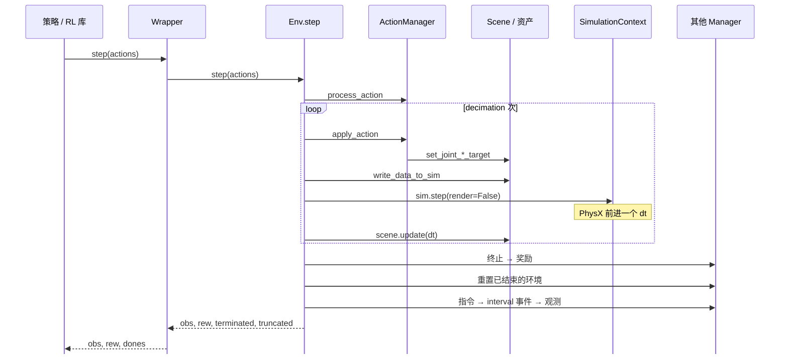

# 一个 RL step 里发生了什么

!!! abstract "学习目标"
    读完本页你能：

    - 按顺序说出一次 `env.step(action)` 内部发生的事，以及每一步由哪个类负责
    - 区分物理步长、控制周期、渲染间隔三个时间尺度，知道改哪个参数影响什么
    - 解释为什么一次 step 同时推进几千个环境，而不是逐个循环
    - 指出 Direct 环境在这张图上替换了哪些环节

!!! info "前置知识"
    - [0.2 分层依赖图](0.2-layers.md)：本页每一步都会标注它落在哪一层

本页的时序图是全站的锚点图。之后讲仿真循环（[3.1](../3-isaacsim/3.1-sim-loop.md)）、各个 Manager（[4.9](../4-isaaclab/4.9-manager-based-env.md)）、源码导读（[9.1](../9-source/9.1-rl-env-step.md)）时都会回到这里。本页以 Isaac Lab v2.3.2 的 Manager-based 环境 `ManagerBasedRLEnv` 为准。

## 一圈时序图

这一节回答：策略给出一个动作，到它拿回下一帧观测，中间经过了谁？

下图按源码中 `ManagerBasedRLEnv.step()` 的实际执行顺序画出[^rl-step]。灰色 `loop` 框是 decimation 循环：一个 RL step 内执行多次物理步。

*图 1：一次 `env.step()` 的调用时序（Isaac Lab 2.3.2，Manager-based）。实线是调用，虚线是返回；loop 框内的步骤每个 RL step 执行 `decimation` 次。渲染没有画进图里，它只在满足条件时才发生，见下文"三个时间尺度"。*

## 逐步说明

这一节回答：图上每一步具体是哪个类的哪个方法，落在哪一层？

"层"一列对应 [0.2 分层依赖图](0.2-layers.md) 的层次。行号均指向 v2.3.2 源码。

| # | 发生什么 | 层 | 类与方法 | 源码 |
|---|---|---|---|---|
| 1 | RL 库把一批动作交给 wrapper；wrapper 按需裁剪后调用环境 | RL 库 / Isaac Lab | `RslRlVecEnvWrapper.step` | [^wrapper] |
| 2 | 动作按 term 切分，每个 term 做缩放、偏移等处理，结果缓存起来 | Isaac Lab | `ActionManager.process_action` → `ActionTerm.process_actions` | [^rl-step] L173；[^action-mgr] L372；[^joint-action] L169 |
| 3 | 进入 decimation 循环；每一轮把处理好的动作写成关节目标（例如 `JointPositionAction` 调用 `set_joint_position_target`） | Isaac Lab | `ActionManager.apply_action` → `ActionTerm.apply_actions` | [^rl-step] L182、L185；[^action-mgr] L395；[^joint-action] L197 |
| 4 | 资产经执行器模型（actuator）算出实际下发的目标或力矩，写入 PhysX 缓冲区 | Isaac Lab → PhysX | `InteractiveScene.write_data_to_sim` → `Articulation.write_data_to_sim` | [^rl-step] L187；[^scene] L465；[^articulation] L218、L258 |
| 5 | 只推进物理，不渲染；Isaac Sim 的 `PhysicsContext` 调用 PhysX 的 simulate 与 fetch_results | Isaac Lab → Isaac Sim → PhysX | `SimulationContext.step(render=False)` | [^rl-step] L189；[^simctx] L541；[^sim-simctx] L713；[^sim-physctx] L563 |
| 6 | 资产数据的时间戳前进一个 `dt`；关节位置等张量在下次被读取时才从 PhysX 取回（惰性读取） | Isaac Lab | `InteractiveScene.update` → `ArticulationData.update` | [^rl-step] L197；[^scene] L479；[^artdata] L97、L754 |
| 7 | 循环结束，回合计数加一，计算终止条件（分为 terminated 与 time_outs） | Isaac Lab | `TerminationManager.compute` | [^rl-step] L204 |
| 8 | 计算奖励，各项按权重乘以 `step_dt` 求和 | Isaac Lab | `RewardManager.compute(dt=step_dt)` | [^rl-step] L208 |
| 9 | 对已结束的环境执行课程更新、场景重置、reset 事件，并清零各 Manager 的状态 | Isaac Lab | `ManagerBasedRLEnv._reset_idx` | [^rl-step] L221、L349–L394 |
| 10 | 更新目标指令，执行 interval 类事件（例如周期性推一下机器人） | Isaac Lab | `CommandManager.compute`、`EventManager.apply(mode="interval")` | [^rl-step] L232、L235 |
| 11 | 计算观测，此时读取的是步 6 之后的最新物理状态 | Isaac Lab | `ObservationManager.compute(update_history=True)` | [^rl-step] L238 |
| 12 | 返回观测、奖励、terminated、truncated、extras；rsl_rl wrapper 把后两者合并成 dones | Isaac Lab / RL 库 | `ManagerBasedRLEnv.step` 返回值 | [^rl-step] L241；[^wrapper] |

注意两个顺序上的细节：

- **观测在重置之后计算**（步 9 在步 11 之前）。已结束环境返回的观测是新回合的第一帧，源码注释也说明了这一点[^rl-step]。
- **奖励在重置之前计算**（步 8 在步 9 之前）。所以结束那一步的奖励仍按旧回合的状态计算。

## 三个时间尺度

这一节回答：`dt`、decimation、`render_interval` 分别管什么？

| 名称 | 定义 | 默认值（源码） | 官方 reach 任务的取值 | 改它影响什么 |
|---|---|---|---|---|
| 物理步长 `physics_dt` | `cfg.sim.dt` | 1/60 s[^sim-cfg] | 1/60 s（60 Hz）[^reach] | 仿真精度与稳定性；越小越准，但同样的仿真时长要算更多步 |
| 控制周期 `step_dt` | `cfg.sim.dt × cfg.decimation` | `decimation` 无默认值，必须由任务设置[^env-cfg] | 1/60 × 2 = 1/30 s（30 Hz） | 策略多久出一次动作；决定每个 RL step 内执行几次物理步 |
| 渲染间隔 | 每 `cfg.sim.render_interval` 个物理步渲染一次 | 1[^sim-cfg] | 设为等于 decimation，即每个 RL step 渲染一次 | 只在有 GUI 或 RTX 传感器时生效；影响画面刷新率与相机数据的新鲜度 |

`physics_dt` 和 `step_dt` 在环境基类里定义为两个属性[^base-env]。回合长度按控制周期换算：reach 任务 `episode_length_s = 12.0`[^reach]，即 12 ÷ (1/30) = 360 个 RL step。

渲染的条件写在循环里：物理步计数是 `render_interval` 的整数倍，**并且** `has_gui()` 或 `has_rtx_sensors()` 为真，才调用 `sim.render()`[^rl-step]（L179、L194–L195）。headless 训练、场景里又没有相机时，整个训练过程不渲染。

调参时的对应关系：

- 机器人抖动、穿模：先看 `sim.dt` 和 PhysX 求解参数，属于物理层，见 [3.3](../3-isaacsim/3.3-rigid-collision.md)。
- 想让策略控制更频繁：减小 decimation；训练会变慢，因为同样的仿真时长要做更多次策略推理。
- 改了 decimation 之后，记得同步检查 `render_interval` 和 `episode_length_s` 的含义是否仍符合预期。

## 数据在哪里

这一节回答：几千个环境是怎么同时推进的？

`step()` 的输入和所有输出都是张量，第一维是环境数：动作的形状是 `(num_envs, action_dim)`[^rl-step]，奖励、终止标志是 `(num_envs,)`，观测按组是 `(num_envs, …)`。它们默认在 GPU 上（`SimulationCfg.device = "cuda:0"`[^sim-cfg]）。

所以 `step()` 里没有"对每个环境循环"的代码。decimation 循环是时间上的循环，每一轮都一次性推进全部环境。PhysX 的读写也是批量的：`Articulation` 通过 `root_physx_view` 一次性设置或读取所有环境的关节数据[^articulation][^artdata]。

为什么要这样设计，以及它和强化学习样本效率的关系，见 [5.4 为什么需要几千个并行环境](../5-rl/5.4-parallel-envs.md)。

## Direct 环境的差异

这一节回答：不用 Manager 的写法，这张图哪里会变？

`DirectRLEnv.step()` 保留了相同的骨架：decimation 循环、`write_data_to_sim`、`sim.step(render=False)`、`scene.update` 都还在[^direct]。变化是图 1 中 ActionManager 和"其他 Manager"那两列，换成了你在子类里实现的方法：

| Manager-based | Direct（用户实现） | 源码 |
|---|---|---|
| `ActionManager.process_action` | `_pre_physics_step(actions)` | [^direct] L363 |
| `ActionManager.apply_action` | `_apply_action()` | [^direct] L373 |
| `TerminationManager.compute` | `_get_dones()` | [^direct] L391 |
| `RewardManager.compute` | `_get_rewards()` | [^direct] L393 |
| `ObservationManager.compute` | `_get_observations()` | [^direct] L410 |

若配置了 `events`，interval 事件在 Direct 环境中仍由 `EventManager` 处理[^direct]（L405–L407）。两种写法怎么选，见 [4.14 Direct 环境](../4-isaaclab/4.14-direct-env.md)。

## 常见误解

!!! warning "误解一：一个 step 就是一次物理步"
    一个 RL step 包含 `decimation` 次物理步[^rl-step]。reach 任务中是 2 次[^reach]。日志里的"步数"通常指 RL step；要换算成仿真时间，得乘以 `step_dt`，而不是 `sim.dt`。

!!! warning "误解二：reset 会重新加载场景"
    不会。`_reset_idx` 只对结束的那部分环境（`env_ids`）调用 `scene.reset`，再用 reset 事件写入新的初始状态，并清零各 Manager 的缓冲[^rl-step]（L349–L394）。USD 场景和其他环境都不受影响，也不会打断同一批次里还在运行的环境。

!!! warning "误解三：渲染每步都发生"
    `sim.step` 调用时固定传 `render=False`。渲染只在满足 `render_interval` 且有 GUI 或 RTX 传感器时才发生[^rl-step]。反过来，如果你加了相机，却把 `render_interval` 设得比 decimation 大，相机数据就会比控制周期旧。

!!! warning "误解四：资产的 `data.*` 每个物理步都会从 GPU 拷一次"
    `ArticulationData.update` 只推进时间戳。`joint_pos` 这类属性在被读取、且发现时间戳过期时，才从 PhysX 视图取数据[^artdata]。没人读的量不产生开销。

## 延伸阅读

- 源码：
    - [`manager_based_rl_env.py` @ v2.3.2](https://github.com/isaac-sim/IsaacLab/blob/v2.3.2/source/isaaclab/isaaclab/envs/manager_based_rl_env.py)（本页主线）
    - [`direct_rl_env.py` @ v2.3.2](https://github.com/isaac-sim/IsaacLab/blob/v2.3.2/source/isaaclab/isaaclab/envs/direct_rl_env.py)
    - [`simulation_cfg.py` @ v2.3.2](https://github.com/isaac-sim/IsaacLab/blob/v2.3.2/source/isaaclab/isaaclab/sim/simulation_cfg.py)
- 官方文档：
    - [Isaac Lab 2.3.2：Task Design Workflows](https://isaac-sim.github.io/IsaacLab/v2.3.2/source/overview/core-concepts/task_workflows.html)（Manager-based 与 Direct 两种工作流）
    - [Isaac Lab 2.3.2 API：`isaaclab.envs`](https://isaac-sim.github.io/IsaacLab/v2.3.2/source/api/lab/isaaclab.envs.html)
- 本站：[4.9 Manager-based 环境：总览](../4-isaaclab/4.9-manager-based-env.md)、[9.1 `ManagerBasedRLEnv.step()` 逐行读](../9-source/9.1-rl-env-step.md)

## 版本说明

- **Isaac Lab 2.x 其他小版本**：本页只对照了 v2.3.2 源码，未逐一核对其他 2.x 版本。图中省略了 `recorder_manager` 的调用（用于录制示教数据，默认没有 term 时不影响流程）以及重置后按 `num_rerenders_on_reset` 补渲染的分支[^rl-step]。
- **Isaac Lab 3.0.0-EA**：资产与传感器的 `.data.*` 返回 `ProxyArray` 而非 `torch.Tensor`；写入方法拆分为 `_index` 与 `_mask` 两种；物理后端可选 Newton，此时步 5 不再经过 Isaac Sim 与 PhysX[^lab30-rn]。详见 [8.1 3.0 改了什么、为什么改](../8-frontier/8.1-what-changed.md)。

[^rl-step]: Isaac Lab `manager_based_rl_env.py`（tag v2.3.2）：<https://github.com/isaac-sim/IsaacLab/blob/v2.3.2/source/isaaclab/isaaclab/envs/manager_based_rl_env.py#L153-L241>（`step()` 全流程；动作形状 `(num_envs, action_dim)`；L179 判断是否需要渲染；L182 decimation 循环；L189 `sim.step(render=False)`；L194–L195 按 `render_interval` 渲染；L237 注释说明观测在重置之后计算；L349–L394 `_reset_idx`）
[^wrapper]: Isaac Lab `isaaclab_rl/rsl_rl/vecenv_wrapper.py`（tag v2.3.2）：<https://github.com/isaac-sim/IsaacLab/blob/v2.3.2/source/isaaclab_rl/isaaclab_rl/rsl_rl/vecenv_wrapper.py#L151-L164>（按 `clip_actions` 裁剪；调用 `env.step`；把 terminated 与 truncated 合成 dones）
[^action-mgr]: Isaac Lab `managers/action_manager.py`（tag v2.3.2）：<https://github.com/isaac-sim/IsaacLab/blob/v2.3.2/source/isaaclab/isaaclab/managers/action_manager.py#L372-L402>（`process_action` 按 term 切分并调用 `process_actions`；`apply_action` 调用各 term 的 `apply_actions`）
[^joint-action]: Isaac Lab `envs/mdp/actions/joint_actions.py`（tag v2.3.2）：<https://github.com/isaac-sim/IsaacLab/blob/v2.3.2/source/isaaclab/isaaclab/envs/mdp/actions/joint_actions.py#L169-L199>（缩放加偏移；`JointPositionAction.apply_actions` 调用 `set_joint_position_target`）
[^scene]: Isaac Lab `scene/interactive_scene.py`（tag v2.3.2）：<https://github.com/isaac-sim/IsaacLab/blob/v2.3.2/source/isaaclab/isaaclab/scene/interactive_scene.py#L443-L498>（`reset`、`write_data_to_sim`、`update` 逐个转发给场景中的资产与传感器）
[^articulation]: Isaac Lab `assets/articulation/articulation.py`（tag v2.3.2）：<https://github.com/isaac-sim/IsaacLab/blob/v2.3.2/source/isaaclab/isaaclab/assets/articulation/articulation.py#L218-L267>（`write_data_to_sim` 先调用执行器模型，再通过 `root_physx_view` 批量设置关节力矩与位置、速度目标；`update` 转发给 data）
[^artdata]: Isaac Lab `assets/articulation/articulation_data.py`（tag v2.3.2）：<https://github.com/isaac-sim/IsaacLab/blob/v2.3.2/source/isaaclab/isaaclab/assets/articulation/articulation_data.py#L97>（`update` 只推进时间戳；L754 起 `joint_pos` 在时间戳过期时才从 PhysX 视图读取）
[^simctx]: Isaac Lab `sim/simulation_context.py`（tag v2.3.2）：<https://github.com/isaac-sim/IsaacLab/blob/v2.3.2/source/isaaclab/isaaclab/sim/simulation_context.py#L541-L580>（Isaac Lab 的 `SimulationContext` 继承自 `isaacsim.core.api` 的同名类，`step` 最终调用父类）
[^sim-simctx]: Isaac Sim `isaacsim.core.api` `simulation_context.py`（tag v5.1.0）：<https://github.com/isaac-sim/IsaacSim/blob/v5.1.0/source/extensions/isaacsim.core.api/python/impl/simulation_context/simulation_context.py#L672-L714>（`render=False` 时只调用 `PhysicsContext._step`）
[^sim-physctx]: Isaac Sim `isaacsim.core.api` `physics_context.py`（tag v5.1.0）：<https://github.com/isaac-sim/IsaacSim/blob/v5.1.0/source/extensions/isaacsim.core.api/python/impl/physics_context/physics_context.py#L563-L565>（调用 PhysX 仿真接口的 simulate 与 fetch_results）
[^sim-cfg]: Isaac Lab `sim/simulation_cfg.py`（tag v2.3.2）：<https://github.com/isaac-sim/IsaacLab/blob/v2.3.2/source/isaaclab/isaaclab/sim/simulation_cfg.py#L349-L371>（`device` 默认 `cuda:0`；`dt` 默认 1/60；`render_interval` 默认 1）
[^env-cfg]: Isaac Lab `envs/manager_based_env_cfg.py`（tag v2.3.2）：<https://github.com/isaac-sim/IsaacLab/blob/v2.3.2/source/isaaclab/isaaclab/envs/manager_based_env_cfg.py#L70>（`decimation` 为 MISSING，必须设置）
[^base-env]: Isaac Lab `envs/manager_based_env.py`（tag v2.3.2）：<https://github.com/isaac-sim/IsaacLab/blob/v2.3.2/source/isaaclab/isaaclab/envs/manager_based_env.py#L228-L241>（`physics_dt = sim.dt`；`step_dt = sim.dt × decimation`）
[^reach]: Isaac Lab `reach_env_cfg.py`（tag v2.3.2）：<https://github.com/isaac-sim/IsaacLab/blob/v2.3.2/source/isaaclab_tasks/isaaclab_tasks/manager_based/manipulation/reach/reach_env_cfg.py#L207-L212>（`decimation = 2`；`render_interval = decimation`；`episode_length_s = 12.0`；`sim.dt = 1/60`）
[^direct]: Isaac Lab `envs/direct_rl_env.py`（tag v2.3.2）：<https://github.com/isaac-sim/IsaacLab/blob/v2.3.2/source/isaaclab/isaaclab/envs/direct_rl_env.py#L333-L410>（`step()` 中依次调用 `_pre_physics_step`、`_apply_action`、`_get_dones`、`_get_rewards`、`_reset_idx`、`_get_observations`；L405–L407 配置了 events 时执行 interval 事件）
[^lab30-rn]: Isaac Lab v3.0.0-EA Release Notes：<https://github.com/isaac-sim/IsaacLab/releases/tag/v3.0.0-EA>（ProxyArray；`write_*_to_sim_index` 与 `_mask`；Newton 后端）
