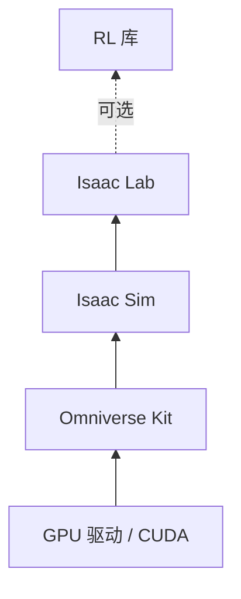

# 渲染检查页

本页不进导航，用于确认站点的 Markdown 扩展渲染正常，也可作为写作模板参考。

!!! abstract "学习目标"
    读完本页你能：

    - 确认 admonition、Mermaid、代码 tabs、脚注均可渲染

!!! info "前置知识"
    - 无

## Mermaid

下图是一个自底向上的依赖示意，用于检查 Mermaid 在浅色/深色模式下的可读性。



## Admonition

!!! note "note"
    说明性补充。

!!! tip "tip"
    实用技巧。

!!! warning "warning"
    常见坑，"常见坑"一节的每一条都用这种框。

!!! danger "danger"
    可能造成数据丢失或硬件损坏的操作。

??? note "可折叠（pymdownx.details）"
    折叠内容。

## 代码 tabs

=== "Python"

    ```python
    import torch

    x = torch.zeros(4, device="cuda")
    ```

=== "Shell"

    ```bash
    echo "hello"
    ```

## 脚注

这是一句带来源的断言[^1]。

[^1]: 来源示例：[MkDocs Material 文档](https://squidfunk.github.io/mkdocs-material/)。

## 常见坑

（无）

## 延伸阅读

- [MkDocs Material Reference](https://squidfunk.github.io/mkdocs-material/reference/)

## 版本说明

与 Isaac 版本无关。
