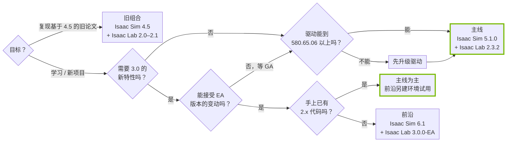

# 版本选择决策树

!!! abstract "学习目标"
    读完本页你能：

    - 回答几个问题后，确定自己该装哪套 Isaac Sim + Isaac Lab 组合
    - 说出本站为什么以 5.1.0 + 2.3.2 为主线
    - 在一台机器上让主线与前沿两套环境并存

!!! info "前置知识"
    - [1.1 版本兼容矩阵](1.1-compat-matrix.md)：各版本的依赖数值都在那里

## 决策树

这一节回答：我该装哪一套？

从左往右回答问题，走到的叶子就是建议组合。每个判断的依据在下文和 [1.1](1.1-compat-matrix.md) 中。

*图 1：版本选择决策树，左→右阅读。菱形是问题，方框是建议组合，绿色粗框是本站推荐的结果。前沿组合同样要求驱动 ≥ 580.65.06，图中为简洁未重复画出。*

## 每个结果的理由

这一节回答：为什么是这个建议？

**主线：Isaac Sim 5.1.0 + Isaac Lab 2.3.2。** 这是 Isaac Lab 2.3.2 官方推荐的组合[^idx232]，也是 2.x 系列的最后一个版本[^rel232]。它稳定，教程、社区讨论和第三方代码最多。本站所有示例都在这个组合上验证。代价是用不到 3.0 的新后端。

**前沿：Isaac Sim 6.1 + Isaac Lab 3.0.0-EA。** 3.0 带来多物理后端、Kit-less 运行和 Warp 原生数据路径[^lab30]。但它目前是 Early Access：官方表示 EA 到 GA 期间只修缺陷，GA 目标在 2026 年 10 月底[^lab30]；同时它有大量破坏性变更，如四元数顺序从 WXYZ 改为 XYZW、`.data.*` 不再直接返回 `torch.Tensor`[^lab30]。这意味着 2.x 的代码和教程不能直接照搬，EA 期间的细节也可能再变。本站把 3.0 的内容集中在第 8 部分，并标注"EA，可能变动"。

**主线为主、前沿另建环境试用。** 已经有 2.x 代码又想试 3.0 的人，最稳妥的做法是不动原环境，另建一套 3.0 环境做迁移实验。3.0 官方也要求从全新的 Python 3.12 环境开始，不要在 2.x 环境上原地升级[^lab30]。

**旧组合：Isaac Sim 4.5 + Isaac Lab 2.0–2.1。** 只在复现明确基于这套版本的旧论文代码时使用。2.0.x、2.1.x 只支持 Isaac Sim 4.5[^readme]，需要 Python 3.10[^pypi]。不建议用它开新项目：Isaac Sim 4.5 的官方文档站已经下线（见 [1.1](1.1-compat-matrix.md) 的说明）。

**先升级驱动。** 2.3.2 与 3.0 的安装页都推荐 Linux 驱动 580.65.06 或更新[^idx232][^lab30-install]，3.0 使用的 CUDA 13.0 PyTorch 更是以它为下限[^lab30-install]。能升级就先升级；实在不能升级（例如共享集群），请先与管理员确认，本站不对低于推荐版本的驱动做验证。

## 两套并存

这一节回答：一台机器能同时装主线和前沿吗？

可以，关键是**两套独立的 Python 环境**。主线的 Isaac Sim 5.1 要求 Python 3.11，前沿的 Isaac Sim 6.1 与 Isaac Lab 3.0 要求 Python 3.12[^pypi][^lab30-install]，两者本来就不能装在同一个环境里。

建议的做法：

- 用 conda 或 venv 各建一个环境，名字里带上版本，例如 `env_isaaclab_23` 和 `env_isaaclab_30`。
- 两套 Isaac Lab 源码放在不同目录，各自对应自己的环境。
- 资产缓存与训练输出目录分开，避免 USD 资产和 checkpoint 混用。

具体安装步骤见 [1.4 安装 Isaac Sim 5.1 + Isaac Lab 2.3.2（pip 方式）](1.4-install-51-232.md) 与 [1.5 安装 Isaac Sim 6.1 + Isaac Lab 3.0-EA](1.5-install-61-30.md)。

## 常见误解

!!! warning "误解一：新版本一定更好"
    对学习和新项目来说，稳定比新更重要。3.0.0-EA 仍在 EA 阶段，并且有大量破坏性变更[^lab30]；用它学习，会同时碰到框架本身的变动和网上 2.x 资料对不上的问题。

!!! warning "误解二：Isaac Lab 3.0 可以配 Isaac Sim 5.1"
    不行。3.0 的完整 Isaac Sim 工作流只支持 6.1，官方明确写明不支持 5.1 及更早版本[^lab30-install]。

!!! warning "误解三：装了 Isaac Sim 6.1 就能跑 Isaac Lab 2.3.2 的例子"
    也不行。2.3.x 声明支持的是 Isaac Sim 4.5、5.0、5.1[^readme]，而且 6.1 要求 Python 3.12，2.3.2 的环境是 3.11[^pypi]。

!!! warning "误解四：驱动越新越好，随便装最新的"
    官方建议使用**生产分支（production branch）**的最新驱动[^idx232]，不是任意最新的测试版驱动。

## 切换时机

这一节回答：本站什么时候把主线换成 3.0？

3.0 发布 GA 之后，本站会评估是否把主线切换到 Isaac Sim 6.1 + Isaac Lab 3.0。切换前，主线页面保持 5.1.0 + 2.3.2 不变。进展与变更记录见 [8.6 3.0 版本追踪](../8-frontier/8.6-version-tracking.md)。

## 延伸阅读

- [1.1 版本兼容矩阵](1.1-compat-matrix.md)
- [8.1 3.0 改了什么、为什么改](../8-frontier/8.1-what-changed.md)
- [Isaac Lab v3.0.0-EA Release Notes](https://github.com/isaac-sim/IsaacLab/releases/tag/v3.0.0-EA)

## 版本说明

本页的建议针对 2026-09-30 的版本状况：主线 2.3.2 为 2.x 的最终版本，3.0 为 EA。3.0 GA 后本页会随切换决定更新。

[^idx232]: Isaac Lab 2.3.2 Local Installation：<https://isaac-sim.github.io/IsaacLab/v2.3.2/source/setup/installation/index.html>（推荐 Isaac Sim 5.1.0；Linux 推荐驱动 580.65.06 或更新；使用最新的生产分支驱动）
[^rel232]: Isaac Lab v2.3.2 Release：<https://github.com/isaac-sim/IsaacLab/releases/tag/v2.3.2>（当前 main 分支的最后一个版本，后续开发转向 develop 分支，朝 3.0 推进）
[^lab30]: Isaac Lab v3.0.0-EA Release Notes：<https://github.com/isaac-sim/IsaacLab/releases/tag/v3.0.0-EA>（多后端、Kit-less、Warp 原生数据；EA 到 GA 只做缺陷修复、稳定性与文档改进，GA 目标 2026 年 10 月底；四元数改为 XYZW；`.data.*` 返回 ProxyArray；需从全新的 Python 3.12 环境开始，不要原地升级 2.x 环境）
[^lab30-install]: Isaac Lab 3.0 Installation：<https://isaac-sim.github.io/IsaacLab/release/3.0.0/source/setup/installation/index.html>（完整 Isaac Sim 工作流需 Python 3.12；不支持 Isaac Sim 5.1 及更早版本；CUDA 13.0 PyTorch 需 Linux 驱动 ≥ 580.65.06）
[^readme]: Isaac Lab README（tag v2.3.2），Isaac Sim Version Dependency：<https://github.com/isaac-sim/IsaacLab/blob/v2.3.2/README.md#L58-L64>（v2.3.X 支持 4.5 / 5.0 / 5.1；v2.1.X、v2.0.X 支持 4.5）
[^pypi]: PyPI `isaacsim`：<https://pypi.org/project/isaacsim/#history>（4.5.0.0 要求 Python 3.10；5.x 要求 3.11；6.x 要求 3.12）
