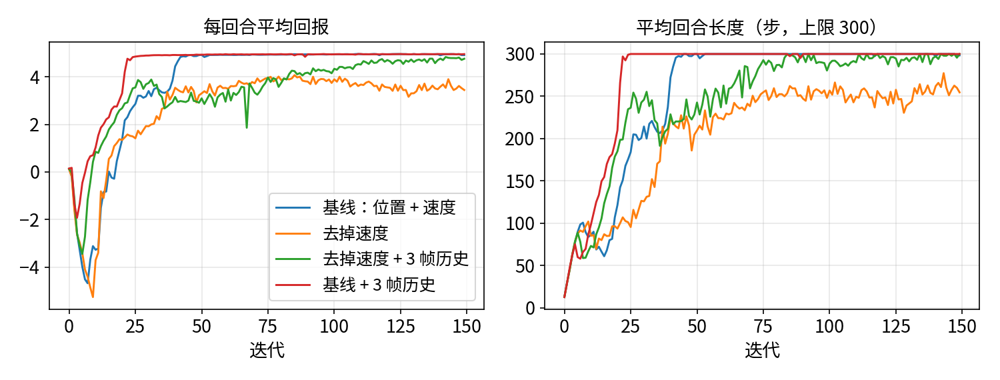

# 观测设计与对称性

:::{admonition} 学习目标
:class: lead-goals

- 为一个任务决定观测里放什么、不放什么，并说出理由
- 知道历史帧与特权信息各解决什么问题
- 看懂官方任务里 `policy` / `critic` 两个观测组的设计意图，会在 rsl_rl 里启用非对称 actor-critic
:::

:::{admonition} 前置知识
:class: lead-prereq

- [5.1 用一个任务理解 MDP](5.1-mdp.md)、[5.2 策略与价值](5.2-policy-value.md)、[4.10 Observation / Action Manager](../4-isaaclab/4.10-observation-action.md)
:::

## 观测要回答什么问题

这一节回答：观测里该放什么？

观测要回答的问题是：**策略需要知道什么，才能决定下一步动作**。[5.1](5.1-mdp.md) 讲过，观测是状态中策略能看到的那一部分。以机械臂 reach 为例（[6.4.1](../6-galbot/4-task/6.4.1-reach.md)）：

| 观测项 | 在不在 | 为什么 |
|---|---|---|
| 关节位置 | 在 | 不知道自己在哪，就不知道往哪走 |
| 关节速度 | 在 | 同一位置、不同速度，该出的动作不同（要不要减速） |
| 目标位姿 | 在 | 目标每隔几秒就换（[4.13](../4-isaaclab/4.13-command-manager.md)），不告诉策略就只能猜 |
| 上一步动作 | 在 | 动作经 PD 执行有滞后，知道上一步输出了什么，才能输出平滑的序列 |
| 末端在世界系的绝对位置 | 可省 | 能由关节位置算出；目标已在根坐标系下给出 |
| 桌子、其他物体 | 不在 | reach 不和它们交互 |

*表 1：reach 的观测取舍。前四项即 6.4.1 的观测配置。*

## 三条设计原则

这一节回答：同样的信息，用什么形式给策略？

以下三条是业内常见做法（经验性），Isaac Lab 自带的任务大多遵守。

**① 用相对量，不用绝对量。** 目标位置写成"相对机器人根"而不是"世界系下"，这样机器人放在哪个环境原点、朝哪个方向，同样的相对关系就对应同样的动作。Isaac Lab 的位姿指令本来就在根坐标系下（[4.13](../4-isaaclab/4.13-command-manager.md)），关节量用 `joint_pos_rel`，即减去默认姿态之后的值。

**② 各项量级可比。** 关节角在 ±3 rad 内，速度可能到几十 rad/s，直接拼在一起时，大的那一项会主导网络的输入。处理办法是 `scale` 或观测归一化，见 [5.2](5.2-policy-value.md)，这里不重复。

**③ 不放策略用不上、部署时拿不到的量。** 仿真里能读到摩擦系数、物体的精确位姿、外力，真机上往往拿不到。把它们放进 actor 的观测，训练出的策略会依赖它们，部署时就没法用了。这类量应该交给 critic，见下文；部署前的核对清单见 [6.7.3](../6-galbot/7-deploy/6.7.3-sim2real-checklist.md)。

## 历史帧

这一节回答：只看当前一帧不够时怎么办？

单帧观测不能反映全部状态时（部分可观测），可以把最近几帧堆起来：

- 观测里没有速度，几帧位置之差就隐含了速度；
- 执行有延迟，策略要知道之前几步发出了什么；
- 接触是否发生、地面软硬，要从一段时间的响应里推断。

Isaac Lab 里由观测项或观测组的 `history_length` 控制，`flatten_history_dim=True`（默认）时把 H 帧展平成一维[^obs-cfg]。字段含义与处理顺序见 [4.10](../4-isaaclab/4.10-observation-action.md) 表 1、图 1。用法：

```python
self.observations.policy.history_length = 3     # 整组每项都保留最近 3 帧
```

代价是观测维度乘以 H，网络输入变大，训练需要的数据也更多（经验性）。

用命令行覆盖时要注意：组的 `history_length` 默认是 `None`，写 `env.observations.policy.history_length=3` 会被 Hydra 以类型不符拒绝，报 `ValueError: [Config]: Incorrect type under namespace: /observations/policy/history_length`（本站实测），只能按项写，如 `env.observations.policy.joint_pos_rel.history_length=3`。在 Python 配置里赋值不受此限制。

## 特权信息与非对称 actor-critic

这一节回答：critic 能不能看到 actor 看不到的东西？

可以，而且在仿真里几乎是免费的。critic 只在训练时用来估计价值（[5.2](5.2-policy-value.md)），部署时只带 actor。于是：

- **actor（policy）** 只看部署时拿得到的量，可以加噪声模拟传感器；
- **critic** 可以看真值：物体位姿、摩擦系数、外力，即特权信息（privileged information）。价值估得更准，训练更稳（经验性）。

Isaac Lab 里分两步。环境配置中定义两个观测组：

```python
class ObservationsCfg:
    policy: PolicyCfg = PolicyCfg()     # 部署时也有的量，可带噪声
    critic: CriticCfg = CriticCfg()     # 另加特权量
```

在 rsl_rl 的 runner 配置中用 `obs_groups` 指明谁看哪组[^rl-cfg]：

```python
obs_groups = {"policy": ["policy"], "critic": ["critic"]}
```

官方例子是 `Isaac-Deploy-GearAssembly-UR10e-2F140-v0`：

- policy 组有关节位置、速度和齿轮轴的位姿，轴的位置还加了噪声；
- critic 组在此之外多了齿轮本身的位姿 `gear_pos`、`gear_quat`，而且不加噪声[^gear]；
- runner 配置正是上面那行 `obs_groups`[^gear-agent]。

`obs_groups` 不写时，rsl_rl 3.1.2 按默认规则补全：环境里有 `critic` 组就给 critic 用，没有就用 policy 的观测，同时打印一条警告[^resolve]。本站的 reach 没有 critic 组，训练记录里 `obs_groups: {}`，critic 与 actor 看到的是同一组观测。

## 对称性（进阶，主线不用）

这一节回答：左右对称的机器人能不能少学一半？

许多机器人与任务左右对称：四足向左走与向右走互为镜像，Cartpole 小车往左推与往右推也是。利用这一点有两种做法：

- **数据增广**：把每条样本镜像一份一起训练；
- **镜像损失**：约束策略对镜像输入给出镜像输出。

rsl_rl 的入口是算法配置里的 `symmetry_cfg`（`RslRlSymmetryCfg`：`use_data_augmentation`、`use_mirror_loss`、`data_augmentation_func`、`mirror_loss_coeff`）[^sym]。官方 Cartpole 与 ANYmal-D 都带了一个启用数据增广的 runner 配置，Cartpole 的注册入口名为 `rsl_rl_with_symmetry_cfg_entry_point`[^sym-cartpole]。镜像函数要按机器人的关节排布手写，主线的 Galbot reach 只用右臂，不涉及。

## 实测：去掉关节速度

这一节回答：少一项必需的观测会怎样，历史帧能不能补上？

在官方 `Isaac-Cartpole-v0` 上用 Hydra 命令行覆盖，不改任何文件。4 组都是种子 42、4096 个环境、150 次迭代：

```bash
python scripts/reinforcement_learning/rsl_rl/train.py --task Isaac-Cartpole-v0 --headless --seed 42 \
    env.observations.policy.joint_vel_rel=null \
    env.observations.policy.joint_pos_rel.history_length=3   # 第 3 组：去掉速度，位置留 3 帧
```

| 组 | 策略观测（维度） | 平均回合长度：第 50 次 → 第 100 次 → 最后 10 次 | 平均回报（最后 10 次） |
|---|---|---|---|
| 基线：位置 + 速度 | 4 | 300 → 300 → 299 | 4.9 |
| 去掉速度 | 2 | 210 → 257 → 261 | 3.6 |
| 去掉速度 + 3 帧历史 | 6 | 243 → 289 → 298 | 4.8 |
| 基线 + 3 帧历史 | 12 | 300 → 300 → 300 | 4.9 |

*表 2：本站实测（RTX 5070；每组训练约 18–29 s，进程显存峰值约 2.9 GB）。回合上限 300 步（5 s），小车出界则提前结束。*



*图 1：四组的训练曲线（`plot_obs_ablation.py`）。*

观察到的现象（单种子、单次，只能说观察到，不能下因果结论）：

- 去掉关节速度后，150 次迭代内平均回合长度停在约 260 步，没有达到基线的 300 步；
- 只保留位置、但堆 3 帧历史，曲线回到接近基线的水平（298 步），与"几帧位置之差隐含速度"的说法一致；
- 基线再加历史，最终结果与基线相同；这一组在约 22 次迭代就到了 300 步，比基线早，但只有一个种子，不能说历史帧加快了收敛。

这组对照的脚本与复跑方法见 `examples/isaaclab-2.3/5.6-observation-design/`。

## 常见误解

:::{admonition} 误解一："观测越多越好"
:class: warning

多出来的量如果与动作无关，只会增加输入维度和训练所需的数据；如果部署时拿不到，策略还会依赖它（原则 ③）。只放回答"下一步怎么动"所需的量。
:::

:::{admonition} 误解二："critic 看到特权信息，会泄露到部署的策略里"
:class: warning

部署时只带 actor，critic 不参与。特权信息只影响训练时的价值估计，actor 的输入里没有它。actor 会间接受益于更准的价值估计，但部署时并不需要这些量。
:::

:::{admonition} 误解三："堆了历史帧，策略就有记忆了"
:class: warning

历史帧只覆盖固定的最近 H 步，更早的信息一概看不到。需要长时记忆的任务要用循环网络（RNN / LSTM），rsl_rl 有对应的 `RslRlPpoActorCriticRecurrentCfg`，前面的齿轮装配任务用的就是它[^gear-agent]。
:::

## 延伸阅读

- 下一页：[5.7 模仿学习与 RL 的选择](5.7-il-vs-rl.md)

## 版本说明

本页基于 Isaac Lab 2.3.2 与 rsl_rl 3.1.2。3.0 中的情况未核对，见 [8.1 3.0 改了什么、为什么改](../8-frontier/8.1-what-changed.md)。

3.0 的差异以 [8.6 版本追踪](../8-frontier/8.6-version-tracking.md) 为准，本页最后核对的版本见该页核对状态表。

[^obs-cfg]: Isaac Lab `managers/manager_term_cfg.py`（tag v2.3.2）：`ObservationTermCfg.history_length` / `flatten_history_dim` <https://github.com/isaac-sim/IsaacLab/blob/v2.3.2/source/isaaclab/isaaclab/managers/manager_term_cfg.py#L184-L193>；`ObservationGroupCfg` 的同名字段 <https://github.com/isaac-sim/IsaacLab/blob/v2.3.2/source/isaaclab/isaaclab/managers/manager_term_cfg.py#L228-L241>
[^rl-cfg]: Isaac Lab `isaaclab_rl/rsl_rl/rl_cfg.py`（tag v2.3.2）：`obs_groups` <https://github.com/isaac-sim/IsaacLab/blob/v2.3.2/source/isaaclab_rl/isaaclab_rl/rsl_rl/rl_cfg.py#L159-L176>
[^resolve]: rsl_rl `rsl_rl/utils/utils.py`（v3.1.2）：`resolve_obs_groups` <https://github.com/leggedrobotics/rsl_rl/blob/v3.1.2/rsl_rl/utils/utils.py#L203-L296>
[^gear]: Isaac Lab `manipulation/deploy/gear_assembly/gear_assembly_env_cfg.py`（tag v2.3.2）<https://github.com/isaac-sim/IsaacLab/blob/v2.3.2/source/isaaclab_tasks/isaaclab_tasks/manager_based/manipulation/deploy/gear_assembly/gear_assembly_env_cfg.py#L178-L216>
[^gear-agent]: Isaac Lab `gear_assembly/config/ur_10e/agents/rsl_rl_ppo_cfg.py`（tag v2.3.2）<https://github.com/isaac-sim/IsaacLab/blob/v2.3.2/source/isaaclab_tasks/isaaclab_tasks/manager_based/manipulation/deploy/gear_assembly/config/ur_10e/agents/rsl_rl_ppo_cfg.py#L19-L24>
[^sym]: Isaac Lab `isaaclab_rl/rsl_rl/symmetry_cfg.py`（tag v2.3.2）<https://github.com/isaac-sim/IsaacLab/blob/v2.3.2/source/isaaclab_rl/isaaclab_rl/rsl_rl/symmetry_cfg.py>；`rl_cfg.py` 中 `symmetry_cfg` 字段 L128
[^sym-cartpole]: Isaac Lab `classic/cartpole/agents/rsl_rl_ppo_cfg.py`（tag v2.3.2）<https://github.com/isaac-sim/IsaacLab/blob/v2.3.2/source/isaaclab_tasks/isaaclab_tasks/manager_based/classic/cartpole/agents/rsl_rl_ppo_cfg.py#L44-L63>；注册见同目录 `__init__.py` L26
