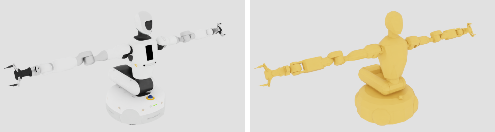

# 碰撞体、质量与惯量调校

:::{admonition} 学习目标
:class: lead-goals

- 用脚本检查每个刚体的质量、质心、惯量与碰撞体，找出可疑项
- 看到碰撞体长什么样，说出每类连杆用的是哪种近似
- 决定自碰撞开还是关，并处理开启后的初始穿透
- 知道碰撞相关的设置该在转换、spawn、运行时哪一层改
:::

:::{admonition} 前置知识
:class: lead-prereq

- [3.3 PhysX 物理：刚体与碰撞](../../3-isaacsim/3.3-rigid-collision.md)
- [6.1.3 对比厂商 USD 与自导入 USD](6.1.3-vendor-vs-imported-usd.md)
:::

本页检查 [6.1.2](6.1.2-import-urdf.md) 转出的固定底座版资产。**本页在项目中新增五个文件、修改一个**：

- `scripts/inspect_inertia.py`：质量、惯量、碰撞体清单，只需 usd-core；
- `scripts/render_collisions.py`：同一相机下渲染视觉网格与碰撞体；
- `scripts/check_contacts.py`：自碰撞与接触的验证实验；
- `scripts/probe_stuck_joint.py`：复现并检查验证中出现的"臂卡住"；
- `source/galbot_academy/galbot_academy/assets/physics.py`：自碰撞过滤对（只依赖 pxr）；
- 修改 `scripts/convert_galbot.py`：转换后把过滤对写进资产。改完要重新运行一次 6.1.2 的转换。

## 质量与惯量

这一节回答：URDF 里的惯性参数，转换后还对吗？

```bash
python scripts/inspect_inertia.py        # 不需要 Isaac Sim
```

脚本逐个刚体列出质量、质心、惯量主值与碰撞体，并与 URDF 对照：合并固定关节后，一个 USD 刚体对应 URDF 里由固定关节连成的一组连杆（[3.5](../../3-isaacsim/3.5-urdf-mjcf-import.md)），脚本把这组的质量加起来比较。结果：

- **34 个刚体的质量与 URDF 组质量逐一相等**，全机 95.184 kg；其中未经合并的 30 个刚体，质心与惯量主值也与 URDF 一致（相对差 ≤ 1.4×10⁻⁷，校验方复核）；
- 按部件：底盘与躯干底座 31.73 kg、腿（躯干升降）44.71 kg、头 2.38 kg、每条臂 8.12 kg、每个夹爪 0.06 kg；
- 惯量主值都满足三角不等式，没有质心离原点超过 0.3 m 的刚体；
- 可疑项两类：夹爪的 8 个指节各只有 7–8 g，惯量主值 10⁻⁷–10⁻⁶ kg·m²；`head_link1` 没有碰撞体。

指节与 31.7 kg 的底盘相差四千多倍，质量比悬殊不利于求解收敛（[3.3](../../3-isaacsim/3.3-rigid-collision.md) 表 1）；但底盘固定、指节由刚化后的 mimic 约束带动，后面的夹爪闭合实验没有抖动，所以不改。`head_link1` 在 URDF 里就没有 visual 与 collision，转换日志中 `</visuals/head_link1>` 的警告也由此而来。

描述仓库的 README 没有给出整机重量，95 kg 只能说与 URDF 自洽。

## 碰撞体现状

这一节回答：PhysX 实际用什么形状算碰撞？

184 个碰撞体中，144 个是网格凸包（`convexHull`），40 个是球体：

| 部位 | 近似方式 | 个数 / 刚体 |
|---|---|---|
| 底盘 `base_link` | 凸包 + 球体（四个全向轮的滚子，随固定关节并入底盘） | 3 + 40 |
| 腿、躯干 | 凸包 | 1–3 |
| 头 | 凸包（只有 `head_link2`） | 1 |
| 臂 | 凸包 | 1–8 |
| 夹爪指节、手指 | 凸包 | 8、3 |

*表 1：各部位的碰撞近似（`inspect_inertia.py`）。一个刚体有多个凸包，是因为 URDF 按零件给了多个碰撞网格（合并固定关节后又归到同一刚体），每个网格一个凸包。*

看碰撞体有两种办法：

- **GUI**：视口菜单 Show By Type → Physics → Colliders，选 All 或 Selected，在视口中画出碰撞形状[^viewport-menu]；同一菜单下还有 Mass Properties。
- **脚本**：`render_collisions.py` 在一个新舞台里引用资产，取消 `visuals` / `collisions` 的实例化，把碰撞体从 guide 改为 default purpose 并绑定橙色材质，然后用同一相机渲染两张图。

```bash
python scripts/render_collisions.py --headless --enable_cameras   # 输出到 generated/render/
```



*图 1：同一视角下的视觉网格（左）与碰撞体（右），零位姿态。本站实测，约 12 秒，按进程显存 1459 MiB。*

凸包把凹处填平，碰撞体比外观略"胖"。对 reach 无关紧要；要抓东西时（[6.4.3](../4-task/6.4.3-lift.md)）再考虑夹爪改用凸分解。

## 自碰撞：开还是关

这一节回答：打开自碰撞会发生什么？

转换时自碰撞是关的（6.1.2 的 `self_collision=False`），可以在 spawn 时用 `ArticulationRootPropertiesCfg(enabled_self_collisions=True)` 打开。`check_contacts.py` 给每个刚体挂接触传感器，并用 `filter_prim_paths_expr` 取得"刚体 × 刚体"的接触力矩阵，找出是哪一对在接触：

```bash
python scripts/check_contacts.py --headless                                 # 自碰撞关
python scripts/check_contacts.py --headless --self_collision --no_filter    # 开，去掉过滤对
python scripts/check_contacts.py --headless --self_collision                # 开，带过滤对（本项目的做法）
```

实验分四段：第 1 步的接触；零位保持 2 s；右臂在关节限位内随机取 20 组姿态（种子 0），各保持 4 s；右夹爪合到上限。

| 设置 | 第 1 步的接触 | 零位最大偏离 | 20 组姿态中有接触 | 末 0.5 s 最大关节速度 |
|---|---|---|---|---|
| 关 | 无 | 0.036 rad | — | 1.50 rad/s |
| 开，无过滤 | `head_link2`–`leg_link5` | 0.181 rad（`head_joint2`） | 20 组 | 5.08 rad/s |
| 开，带过滤 | 无 | 0.036 rad | 3 组 | 9.08 rad/s |

*表 2：自碰撞对照（本站实测，dt = 1/120 s；三种设置只差自碰撞与过滤对，姿态序列相同）。三种设置都没有出现 NaN；每次约 90–160 秒，按进程显存 2315–2379 MiB。*

**不过滤时，零位就有穿透。** PhysX 只自动排除由关节直接相连的两个刚体（[3.3](../../3-isaacsim/3.3-rigid-collision.md)）。头与躯干之间隔着没有碰撞体的 `head_link1`，两者的凸包在零位已经重叠，一开仿真头就被顶偏 0.18 rad。随机姿态下还有两类"假接触"：小臂 `link5` 与腕部 `link7`（隔着很短的 `link6`，10 组）、右夹爪 l、r 两侧的外 / 内指节（共 4 次）。它们都是凸包重叠，不是真实结构的碰撞（推断，依据是这些连杆在真机上由关节约束在一起，重叠只在凸包填平凹处后出现）。

**过滤后，剩下的都是真接触**：臂或手指碰到底盘（2 组）、碰到头（1 组）。这时关节速度会更大，因为驱动目标在身体内部，臂被持续往里压（推断）。

**本项目的选择：开自碰撞，带 7 对过滤**（实验只动了右臂，左侧的 3 对按对称补上，未单独实测）。关掉时，臂可以穿过底盘与头，策略可能学到真机上走不通的路径；开启后只在真实接触时有代价。过滤对写在 `physics.py`，由 `convert_galbot.py` 写进资产，开关放在 [6.1.6](6.1.6-articulation-cfg.md) 的 `ArticulationCfg` 里。自碰撞在多环境下的开销在 [6.2.3](../2-scene/6.2.3-cloning-performance.md) 测量。官方资产两种做法都有：Franka 开启，UR10 与 Agibot 关闭[^lab-assets]。

## 在哪一层改

这一节回答：碰撞相关的设置写在转换脚本、spawn 配置，还是运行时？

| 层 | 手段 | 能改到 | 本项目 |
|---|---|---|---|
| 转换 | `UrdfConverterCfg` 的 `collider_type`、`self_collision`、`collision_from_visuals` 等[^conv-cfg]；转换后用脚本改 USD | 一切，包括实例内部的碰撞体 | mimic 刚度（6.1.2）、过滤对 |
| spawn | `UsdFileCfg` 的 `articulation_props`、`rigid_props`、`mass_props`、`collision_props` | Articulation 根与刚体 Prim 上的属性 | 自碰撞开关（6.1.6） |
| 运行时 | `root_physx_view` 的 `set_contact_offsets` 等；事件项 `randomize_rigid_body_collider_offsets`、`randomize_rigid_body_material`[^events] | 接触偏移、摩擦等 | 域随机化（[6.4.2](../4-task/6.4.2-domain-randomization.md)） |

*表 3：三层改法。*

**spawn 阶段的 `collision_props` 对这份资产不起作用。** 转换器默认 `make_instanceable=True`，碰撞体都在实例（instance）内部，而 Isaac Lab 修改属性时跳过实例 Prim[^apply-nested]。实测：用 `collision_props` 把 contact offset 设为 0.02 m，生效值仍是 1.4–5.3 mm。所以改碰撞体本身要在转换阶段，随机化在运行时。`articulation_props` 能生效（表 2 就是这样打开自碰撞的），因为 Articulation 根不在实例内；`rigid_props`、`mass_props` 按同一逻辑应当生效（推断，未测）。

过滤对写在转换阶段还有一个理由：关系目标写在资产内部，资产被引用到任何路径、克隆多少份，目标都随之重映射[^usd-ref]。

## 验证

这一节回答：带着本项目的设置，机器人稳不稳？

用最后一行命令（开自碰撞、带过滤）：

- **零位保持**：与不开自碰撞完全相同，最大偏离 0.036 rad，末 0.5 s 关节速度不超过 0.13 rad/s；
- **关节目标**：20 组随机姿态没有 NaN。无接触姿态中最大跟踪误差 1.45 rad（第 14 组的 `right_arm_joint3`，脚本中从 0 计为 13），关掉自碰撞时也一样，与碰撞无关；它也不是重力压不住：该姿态下 joint3 只需 4.3 N·m 的重力补偿力矩，力矩上限是 30 N·m。见下面的"卡住"。
- **夹爪闭合**：目标 1.703（上限），4.5 s 后到达 1.7023，无接触，末 0.5 s 速度不超过 0.12 rad/s。

**一个没查明的现象：臂卡住。** `scripts/probe_stuck_joint.py` 复现了这一组：卡住时 joint3 的位置不再变化，PhysX 读回的速度却一直是 +0.49 rad/s；Isaac Lab 估算的驱动力矩（`applied_torque`，按误差估算后截断，不是 PhysX 的实测值[^approx]）停在 30 N·m 的上限。在已卡住的状态下（t = 5 s）每次只改一个条件，每种 3 次，结果逐位相同：

| 条件 | 8 s 后右臂最大误差 |
|---|---|
| 基线 | 1.449 rad（卡住） |
| 关掉休眠与稳定化（`--no_sleep`） | 1.449 rad（卡住） |
| 给 joint3 加 0.05 rad/s 的速度扰动（`--kick 0.05`） | 1.449 rad（回到原处） |
| 只把速度上限从 1.5 改为 100 rad/s（`--vel_limit_at5 100`） | 0.082 rad（解开） |
| 只把力矩上限放大 10 倍（`--effort_scale_at5 10`） | 0.082 rad（解开） |

*表 4：卡住的排除性对照（本站实测，每次约 65–90 秒，按进程显存 2315 MiB）。0.082 rad 是 `right_arm_joint1` 在重力下的正常下垂。*

由此可以确定：卡住与休眠无关，也不是一碰就散的偶然状态；提高速度上限或力矩上限中的任何一个都会解开。校验方的阈值扫描：速度上限在 1.6 rad/s 时走到 1.288 rad 后再次卡住，2 rad/s 以上解开；力矩上限放大到 1.2 倍（36 N·m）即解开；写入原值（1.5 rad/s、×1.0）仍然卡住，说明解开不是写入动作本身造成的。至于 PhysX 内部为何停在"位置不变、速度读数非零"的状态，本站没有查明。读回速度与位置变化不一致的现象在静止保持时也存在，[6.1.5](6.1.5-joint-drive-tuning.md) 记录了它对显式执行器的影响。

接触参数的实际取值（含义见 [3.3](../../3-isaacsim/3.3-rigid-collision.md)）：contact offset 由 PhysX 自动选取，184 个形状在 1.4–5.3 mm 之间；rest offset 为 0；未绑定物理材质，用场景默认材质（静 / 动摩擦 0.5）。

## 没有真机数据的边界

这一节回答：哪些值有来源，哪些是本站定的？

- **来自 URDF**：质量、质心、惯量、碰撞网格、关节限位。本站只验证了转换前后一致，没有核对真机（D-004）。
- **本站的选择**：开自碰撞、7 对过滤对（依据是表 2 的仿真实验）、接触偏移用自动值、指尖不设物理材质。厂商 USD 给指尖设了摩擦 1.5 的材质（6.1.3），本站到 6.4.3 需要抓取时再定。

这些是仿真内自洽的设置，不代表真机。

## 常见坑

:::{admonition} 坑一：`collision_props` 写了却没生效
:class: warning

碰撞体在实例内部时，`collision_props` 被跳过，只有一条 `Could not perform 'modify_collision_properties'` 的 WARNING。改完用 `root_physx_view.get_contact_offsets()` 读回核对。
:::

:::{admonition} 坑二：一开自碰撞，机器人自己把自己顶开
:class: warning

隔着一个连杆的两个刚体不会被自动排除。开自碰撞后先看第 1 步有没有接触：零位就有接触的，是初始穿透，要加过滤对，否则一开始就有关节被推偏。
:::

:::{admonition} 坑三：接触力矩阵全是 0
:class: warning

`filter_prim_paths_expr` 写成 `/World/Galbot/.*` 时，除了 34 个刚体还会匹配到 `joints`、`Looks`、`root_joint`，数目对不上，矩阵全为 0，日志里只有一条 `did not match the correct number of entries` 的 Error。要逐个列出刚体路径。
:::

:::{admonition} 坑四：把"还在路上"当成"卡住了"
:class: warning

夹爪关节限速 0.5 rad/s，臂关节 1.5 rad/s。本站起初只保持 2 s，读到夹爪停在 1.04 rad，其实它还在路上。判断"卡住"之前，先按限速算一下走完全程要多久。
:::

## 延伸阅读

- Isaac Lab 接触传感器 `ContactSensorCfg`（v2.3.2）：<https://github.com/isaac-sim/IsaacLab/blob/v2.3.2/source/isaaclab/isaaclab/sensors/contact_sensor/contact_sensor_cfg.py#L52-L72>
- 下一页：[6.1.5 关节驱动参数调校](6.1.5-joint-drive-tuning.md)

## 版本说明

本页基于 Isaac Sim 5.1.0 与 Isaac Lab 2.3.2。3.0 中的情况未核对，见 [8.1 3.0 改了什么、为什么改](../../8-frontier/8.1-what-changed.md)。

3.0 的差异以 [8.6 版本追踪](../../8-frontier/8.6-version-tracking.md) 为准，本页最后核对的版本见该页核对状态表。

[^viewport-menu]: `omni.physx.ui` 107.3.26（随 Isaac Sim 5.1.0 pip 包安装）`omni/physxui/scripts/physicsViewportMenu.py` 第 115–134 行：在视口的 Show By Type 下注册 Physics 菜单，其中 Colliders 有 None / Selected / All 三档，另有 Mass Properties。该扩展没有公开源码仓库，行号以安装包为准。
[^lab-assets]: Isaac Lab `isaaclab_assets/robots`（tag v2.3.2）：Franka <https://github.com/isaac-sim/IsaacLab/blob/v2.3.2/source/isaaclab_assets/isaaclab_assets/robots/franka.py#L35>、UR10 <https://github.com/isaac-sim/IsaacLab/blob/v2.3.2/source/isaaclab_assets/isaaclab_assets/robots/universal_robots.py#L64>、Agibot <https://github.com/isaac-sim/IsaacLab/blob/v2.3.2/source/isaaclab_assets/isaaclab_assets/robots/agibot.py#L33>
[^conv-cfg]: Isaac Lab `sim/converters/urdf_converter_cfg.py`（tag v2.3.2）：<https://github.com/isaac-sim/IsaacLab/blob/v2.3.2/source/isaaclab/isaaclab/sim/converters/urdf_converter_cfg.py#L115-L131>；`make_instanceable` 默认 True 见 `asset_converter_base_cfg.py` <https://github.com/isaac-sim/IsaacLab/blob/v2.3.2/source/isaaclab/isaaclab/sim/converters/asset_converter_base_cfg.py#L41>
[^events]: Isaac Lab `envs/mdp/events.py`（tag v2.3.2）：`randomize_rigid_body_material` <https://github.com/isaac-sim/IsaacLab/blob/v2.3.2/source/isaaclab/isaaclab/envs/mdp/events.py#L155>、`randomize_rigid_body_collider_offsets` <https://github.com/isaac-sim/IsaacLab/blob/v2.3.2/source/isaaclab/isaaclab/envs/mdp/events.py#L441>（通过 `root_physx_view` 读写 rest / contact offset）
[^apply-nested]: Isaac Lab `sim/utils/prims.py` 的 `apply_nested`（tag v2.3.2）：<https://github.com/isaac-sim/IsaacLab/blob/v2.3.2/source/isaaclab/isaaclab/sim/utils/prims.py#L639-L659>（遇到 `IsInstance()` 的 Prim 直接跳过；一个都没改成时只记 warning）
[^usd-ref]: OpenUSD 术语表 "Path Translation"：<https://openusd.org/release/glossary.html#usdglossary-pathtranslation>（经过引用等组合弧后，路径被换算到舞台的命名空间，关系目标因此仍指向正确的 Prim）
[^approx]: Isaac Lab `actuators/actuator_pd.py`（tag v2.3.2）：<https://github.com/isaac-sim/IsaacLab/blob/v2.3.2/source/isaaclab/isaaclab/actuators/actuator_pd.py#L117-L141>（隐式执行器只按 PD 公式估算力矩，注释为 approximate torques）
