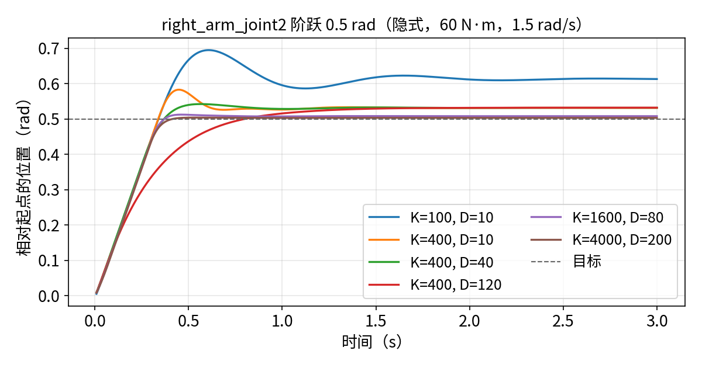

# 关节驱动参数调校

:::{admonition} 学习目标
:class: lead-goals

- 知道驱动参数从哪些数出发，两个来源不一致时取哪个
- 用阶跃响应与重力保持两个实验判断一组 stiffness / damping 好不好
- 分清力矩上限、速度上限各自限制了什么
- 写出本项目的驱动参数表，并知道它在哪里生效
:::

:::{admonition} 前置知识
:class: lead-prereq

- [3.4 关节与 Articulation](../../3-isaacsim/3.4-articulation.md)：关节驱动的 PD 公式
- [4.7 Actuator 模型](../../4-isaaclab/4.7-actuators.md)：隐式与显式执行器、`_sim` 字段
:::

**本页在项目中新增五个文件**：

- `source/galbot_academy/galbot_academy/assets/drives.py`：驱动参数表与 `make_actuators()`，[6.1.6](6.1.6-articulation-cfg.md) 直接引用；
- `scripts/step_response.py`：单关节阶跃响应，一次放多台机器人、每台一组增益；
- `scripts/plot_step.py`：把阶跃曲线画成图（只需 matplotlib）；
- `scripts/gravity_torques.py`：重力力矩统计与重力下的保持测试；
- `scripts/probe_joint_vel.py`：静止时的关节速度读数（T-6.1.5b 补充）。

## 从哪些数出发

这一节回答：参数的初值从哪里来？

| 来源 | 给出什么 | Galbot 的情况 |
|---|---|---|
| URDF `<limit>` | 力矩上限 `effort`、速度上限 `velocity` | 按关节区分，见表 2 |
| 厂商 USD | `maxForce`、驱动增益 | 腿、臂统一 1000 N·m 与 100000 /°（[6.1.3](6.1.3-vendor-vs-imported-usd.md)） |
| 真机手册 / 系统辨识 | 额定与峰值力矩、转速、实测响应 | 本站没有（D-004） |

*表 1：驱动参数的来源。*

两者不一致时，本项目取 URDF 的限位：它按关节区分，更像额定值；厂商 USD 的统一大数更像为演示设定（6.1.3 的推断）。增益两边都不可信，所以要靠下面的实验定。

## 分组

这一节回答：为什么不能所有关节用同一组参数？

| 组 | 关节 | 力矩上限 N·m | 速度上限 rad/s | 控制方式 |
|---|---|---|---|---|
| 腿（躯干升降） | `leg_joint1`–`5` | 169、169、84、30、30 | 1.0 | 位置 |
| 头 | `head_joint1`–`2` | 4 | 1.5 | 位置 |
| 臂（每侧） | `*_arm_joint1`–`7` | 60、60、30、30、10、10、10 | 1.5 | 位置 |
| 夹爪主动关节 | `*_gripper_joint` | 50 | 0.5 | 位置 |
| 底盘轮（仅轮式版） | `wheel1`–`4_joint` | URDF 未给 | URDF 未给 | 速度 |

*表 2：关节分组（固定底座版 URDF 与轮式 URDF，commit 2d496b0）。夹爪的 10 个 mimic 跟随关节没有驱动，由 mimic 约束带动。*

各组承受的负载差别很大（见"重力下的保持"）：腿要撑起整个上半身，臂要托住自身，头和夹爪几乎不受重力。所以刚度的量级不同，腿比臂高一个数量级。底盘轮在轮式版中是 `continuous` 关节，用速度控制：stiffness 设 0，只用 damping 跟踪目标速度。Isaac Lab 的 Ridgeback 配置用同样的做法驱动底盘（作用在表示底盘平移与转动的虚拟关节 `dummy_base_*` 上，不是轮子）[^ridgeback]；轮子的限位要自己定（[6.4.5](../4-task/6.4.5-base-navigation.md)）。

## 阶跃响应实验

这一节回答：一组增益好不好，怎么量？

```bash
python scripts/step_response.py --headless --seconds 3 --csv generated/step/implicit.csv
python scripts/plot_step.py generated/step/implicit.csv --out generated/step/step_response.png
```

阶跃响应（step response）实验：脚本放 6 台机器人，从零位（先保持 3 s）出发，给 `right_arm_joint2` 一个 0.5 rad 的阶跃目标，每台用一组不同的 stiffness（K，N·m/rad）与 damping（D，N·m·s/rad），其余关节按参数表保持零位：

| K | D | 上升时间 s | 超调 % | 2% 调节时间 s | 稳态误差 rad |
|---|---|---|---|---|---|
| 100 | 10 | 0.333 | 13.2 | 1.333 | +0.114 |
| 400 | 10 | 0.283 | 9.7 | 0.583 | +0.032 |
| **400** | **40** | 0.300 | 2.0 | 0.417 | +0.032 |
| 400 | 120 | 0.617 | 0.0 | 1.133 | +0.032 |
| 1600 | 80 | 0.267 | 0.8 | 0.367 | +0.008 |
| 4000 | 200 | 0.267 | 0.1 | 0.383 | +0.003 |

*表 3：阶跃响应（本站实测，隐式执行器，dt = 1/120 s，力矩上限 60 N·m、速度上限 1.5 rad/s 沿用 URDF；每次约 11 秒，按进程显存 2315 MiB）。上升时间（rise time）取 10%→90%；超调（overshoot）与调节时间（settling time）相对最终值；稳态误差（steady-state error）相对目标。*



*图 1：表 3 各组的位置曲线。*

三点观察：

- **上升时间几乎不随增益变**，都在 0.27–0.33 s：0.4 rad（10%→90%）÷ 1.5 rad/s ≈ 0.27 s，起作用的是速度上限。放开速度上限（`--vel_limit 100`）后，K=1600 的上升时间降到 0.117 s。
- **超调由阻尼决定**：K=400 时，D 从 10 到 40 把超调从 9.7% 降到 2.0%；D=120 不再超调，但上升变慢一倍。
- **稳态误差约等于重力力矩除以刚度**：零位时这个关节要承受约 13.7 N·m 的重力力矩（表 5），误差 × K 在四组里分别是 11.4、12.7、13.1、13.6 N·m，与之接近；K 每翻 4 倍，误差约缩小到 1/4。

## 隐式还是显式

这一节回答：本项目用哪种执行器？

```bash
python scripts/step_response.py --headless --seconds 3 --actuator ideal --gains "100:10,400:10,400:40,400:120,1600:80,4000:200,20000:200,20000:2000"
```

同样的实验换成显式的 `IdealPDActuator`：低增益下的响应与隐式接近；K=4000 起末段出现 0.004–0.009 rad 的持续波动，同样增益的隐式执行器没有。这与 [4.7](../../4-isaaclab/4.7-actuators.md) 的结论一致：显式 PD 在一个物理步内力矩不变，增益越高越容易振荡。

另一个差别更隐蔽：显式执行器的阻尼项用 PhysX 读回的关节速度计算[^pd-src]，而本站实测，关节静止时读回的速度并不为 0（位置差分为 0，读数约 0.1 rad/s）。于是阻尼项多出一个恒定力矩，稳态误差随 D 变化：K=400 时，D=40 的误差是 0.021 rad，D=120 只有 0.0005 rad，而隐式执行器三组都是 0.032 rad。这个读数偏差的范围与来源见后文"静止时的速度读数"一节。

**本项目用隐式执行器**：高增益下稳定，稳态行为不受速度读数影响，也是 Isaac Lab 中机械臂配置的常见做法（如 Franka[^franka]）。

## 力矩与速度上限

这一节回答：上限设多少，对响应有什么影响？

| 设置 | 位置曲线 | 最大力矩（估算） |
|---|---|---|
| 力矩上限 60（URDF） | 表 3 | 60 N·m（K ≥ 400 时都顶到上限） |
| 力矩上限 1000（厂商 USD） | 与表 3 相同（调节时间差一个物理步以内） | K=400 约 200 N·m，K=1600 约 800 N·m，K=4000 顶到 1000 N·m |
| 速度上限 100 | 高增益组上升时间降到约 0.1 s（K=1600 为 0.117 s）；D=40 为 0.19 s，D=120 仍为 0.62 s；K=400、D=10 超调升到 26% | 不变 |

*表 4：上限对比（本站实测，`--effort 1000`、`--vel_limit 100`）。隐式执行器的力矩是 Isaac Lab 按 PD 公式估算的[^pd-src]，PhysX 不直接给出。*

表 4 说明了两件事：

- 在这台机器人上，**速度上限比力矩上限更早起作用**。力矩上限从 60 放到 1000，位置曲线一点不变，只是峰值力矩变成真实电机给不出的数。所以用厂商 USD 的 1000 时，问题不会显现在响应曲线上，而会显现在力矩上，要看力矩才发现。
- 字段怎么写：隐式执行器写 `effort_limit_sim`、`velocity_limit_sim`，不写时沿用 USD（即 URDF）的值；显式执行器另有模型内截断的 `effort_limit`，只设 `effort_limit_sim` 时模型内仍按 USD 值截断（[4.7](../../4-isaaclab/4.7-actuators.md)）。上面的显式实验正是如此：`effort_limit_sim` 显示为默认的 1e9，最大力矩却仍是 60 N·m。

## 重力下的保持

这一节回答：各组关节在重力下能不能保持住？

```bash
python scripts/gravity_torques.py --headless
```

脚本放 64 台机器人，第 0 台零位，其余每台所有关节在限位内随机取一组姿态，用 PhysX 的 `get_gravity_compensation_forces()` 读出保持该姿态需要的重力补偿力矩（gravity compensation torque），再以该姿态为目标保持 4 s：

| 关节 | 力矩上限 | 零位需要 | 64 组中最大 | 超过上限的姿态 |
|---|---|---|---|---|
| `leg_joint1` / `2` / `3` | 169 / 169 / 84 | 61 / 163 / 1.7 | 458 / 296 / 136 | 20 / 40 / 36 组 |
| `leg_joint4` / `5` | 30 / 30 | 0 / 0.4 | 31.3 / 63.4 | 1 / 21 组 |
| `right_arm_joint1` / `2` | 60 / 60 | 0.1 / 13.7 | 25.4 / 22.3 | 0 |
| `right_arm_joint3`–`7` | 30–10 | ≤ 4.6 | ≤ 8.9 | 0 |
| 头、夹爪 | 4、50 | ≤ 0.3 | ≤ 0.4 | 0 |

*表 5：重力补偿力矩（N·m，本站实测，种子 0；约 12 秒，按进程显存 2317 MiB）。*

保持 4 s 后，臂的误差中位数 0.004 rad、最大 0.081 rad；头与夹爪都不超过 0.004 rad。腿在很多随机姿态下需要的力矩超过 URDF 的上限，最大误差达 2 rad，也就是撑不住、塌下去了。零位时腿的误差只有 0.001 rad：零位恰好是 `leg_joint1`–`3` 的下限，上半身靠关节限位托住，而不是靠驱动。reach 中腿保持在默认姿态，所以不受影响；换姿态之前要先查表 5（[6.1.6](6.1.6-articulation-cfg.md) 选默认姿态时用到）。真机的腿能否撑住这些姿态，本站无从核对（D-004）。

臂的重力力矩远低于力矩上限，K=400 时最大下垂 0.08 rad。要更准可以把臂的刚度提到 1600（表 3 中稳态误差降到 1/4），代价是更容易顶到力矩上限。reach 的目标精度在厘米级，本项目先用 400。

## 本项目的参数表

这一节回答：最终用什么参数，依据是什么？

| 组 | stiffness | damping | 力矩 / 速度上限 | 依据 |
|---|---|---|---|---|
| 腿 1–3 | 4000 | 400 | URDF | 刚度：经验值，零位由限位托住；上限：URDF |
| 腿 4–5 | 400 | 40 | URDF | 同上 |
| 头 | 400 | 40 | URDF | 实验：保持误差 ≤ 0.002 rad |
| 臂 | 400 | 40 | URDF | 实验：表 3 超调 2%、调节 0.42 s；表 5 下垂 ≤ 0.08 rad |
| 夹爪主动关节 | 100 | 10 | URDF | 实验：6.1.4 中 4.5 s 合到 1.7023（目标 1.703） |

*表 6：驱动参数（`assets/drives.py`）。这是仿真内自洽的参数，不代表真机（D-004）。本页实验用的是资产里的求解器迭代次数（位置 32、速度 1）；项目配置后来改为 16 / 1，对保持误差与阶跃响应的影响在 4% 以内，见 [6.1.6](6.1.6-articulation-cfg.md) 表 2。*

**在哪里设：ArticulationCfg 的执行器。** 转换时写进 USD 的增益（[6.1.2](6.1.2-import-urdf.md)）只是初值，`ArticulationCfg.actuators` 里写了的字段会覆盖它（[4.7](../../4-isaaclab/4.7-actuators.md)）。本项目把参数集中在 `drives.py`，由 `make_actuators()` 组装成 `ImplicitActuatorCfg`；转换脚本的初值与表 6 取相同的数，这样在 GUI 里打开 USD 看到的也是同一组值。以后调参只改 `drives.py`，不必重新转换。

```python
from galbot_academy.assets.drives import make_actuators
actuators = make_actuators()   # {"legs", "head", "arms", "grippers", "mimic"}，各组正则互不重叠
```

## 静止时的速度读数

这一节回答：机器人明明没动，读回的关节速度为什么不是 0？

```bash
python scripts/probe_joint_vel.py --headless                    # Galbot，默认姿态，隐式执行器
python scripts/probe_joint_vel.py --headless --robot franka     # 官方 Franka 对照
python scripts/probe_joint_vel.py --headless --no_gravity       # 关掉重力；另可加 --device cpu、--dt 0.0166667
```

脚本让机器人保持默认姿态 6 s，比较 `robot.data.joint_vel`、直接从 PhysX 读的速度，以及位置差分得到的速度：

| 条件 | Galbot 最大读数 | Franka 最大读数 | 位置差分 |
|---|---|---|---|
| GPU，dt 1/120 | 0.196（夹爪指节）；右臂 0.053 | 0.067（`panda_joint4`） | 0 |
| 关掉重力 | 0 | 0 | 0 |
| CPU 管线 | 0.203 | 0.067 | 0 |
| dt 1/60 | 0.577；右臂 0.109 | 0.133 | 0 |
| dt 1/240 | 0.047 | 0.034 | 0 |

*表 7：静止时的速度读数（rad/s，本站实测，每种条件 3 次，结果逐位相同；每次约 20 秒，按进程显存 2315 MiB）。*

已证实：

- 读数在静止时恒定，不随时间衰减；位置并没有在动（6 s 内漂移不到 0.01 rad）；
- Isaac Lab 的缓冲与直接从 PhysX 读的值相同，不是数据更新时机的问题（[4.6](../../4-isaaclab/4.6-assets.md)）；
- 必须有重力才出现，GPU 与 CPU 管线都有，官方 Franka 也有，所以不是 Galbot 资产特有的；
- 受重力影响大的关节读数大；dt 越大读数越大，Franka 上与 dt 成正比。

推断：读数近似于"一步之内重力造成的关节速度增量"。依据是在 Franka 上，读数为 |M⁻¹τ_g|·dt 的 0.26–0.44 倍（joint1–4 约 0.38–0.44，joint6 为 0.26；M 为关节空间质量矩阵，τ_g 为重力力矩，各关节排序一致）。PhysX 内部为何如此，本站没有查明。Galbot 夹爪指节的读数不符合这个比例，可能与 mimic 约束有关（推断）。上游 Isaac Lab 与 PhysX 仓库中未找到相关 issue。

对训练的影响：读数是恒定、可复现的偏置，不是随机噪声。reach 的右臂在 dt 1/120 时最大 0.05 rad/s、在官方 reach 用的 dt 1/60 时约 0.11 rad/s，约为臂关节速度上限 1.5 rad/s 的 3%–7%。它比官方 reach 加在 `joint_vel` 观测上的 ±0.01 rad/s 噪声大，但策略输入里的一个常数偏移并不妨碍学习；进入 `joint_vel_l2` 惩罚的量要看惩罚覆盖哪些关节：只算右臂时，按课程学习后的权重 −0.001 约为 10⁻⁵ 每步，可以忽略；官方 reach 的惩罚覆盖机器人全部关节（`SceneEntityCfg("robot")`），对 Galbot 而言还包括读数大得多的夹爪指节，dt 1/60 时平方和约 0.56，约 6×10⁻⁴ 每步，就不能忽略了。所以 6.4.1 要把惩罚项的 `asset_cfg` 限定到右臂。本站的结论是：**观测与惩罚都只取右臂关节时，对 reach 训练可以忽略，不加死区或滤波**（推断，6.5.1 的训练结果会检验）。需要注意的地方在别处：显式执行器的阻尼项用它算力矩（"隐式还是显式"一节）；部署到真机时，真机静止读数接近 0，观测分布会有这个差别（列入 [6.7.3](../7-deploy/6.7.3-sim2real-checklist.md)）。

## 常见坑

:::{admonition} 坑一：怎么调增益，上升时间都不变
:class: warning

先看速度上限。Galbot 的臂关节限速 1.5 rad/s，0.5 rad 的阶跃无论刚度多大都要约 0.3 s（表 3）。这时调增益只改变超调与稳态误差。
:::

:::{admonition} 坑二：力矩上限设得过大，曲线看不出问题
:class: warning

沿用厂商 USD 的 1000 N·m 时，位置曲线与 60 N·m 完全相同（表 4），峰值力矩却到了 800–1000 N·m。只看位置会误以为参数没问题；调参时要同时记录力矩。
:::

:::{admonition} 坑三：显式执行器的稳态误差随阻尼变化
:class: warning

`IdealPDActuator` 用读回的关节速度算阻尼项，而有重力时静止读数并不为 0（表 7），阻尼越大，多出的力矩越大。用显式模型时，稳态误差要实测，不能按 τ/K 估算。
:::

:::{admonition} 坑四：默认姿态恰好在关节限位上
:class: warning

Galbot 的零位是腿部前三个关节的下限。保持零位时误差很小，是限位在托着，不代表驱动够用；把腿挪离限位，很多姿态就撑不住（表 5）。
:::

:::{admonition} 坑五：大跨度目标下，臂可能卡在半路
:class: warning

[6.1.4](6.1.4-collision-mass-inertia.md) 的随机姿态实验里，右臂在一个目标上停在离目标 1.45 rad 的地方不动，估算力矩停在上限。用的正是表 6 的增益与 URDF 的上限。排除性对照表明，这与休眠无关，提高速度上限或力矩上限中的任何一个都会解开；机理未查明。调参或写任务时，若关节长时间不动、估算力矩又停在上限，先怀疑这种情况，不要急着加大刚度。
:::

## 延伸阅读

- Isaac Lab 执行器文档（v2.3.2 源文件）：<https://github.com/isaac-sim/IsaacLab/blob/v2.3.2/docs/source/overview/core-concepts/actuators.rst>
- 下一页：[6.1.6 制作 Isaac Lab 的 ArticulationCfg](6.1.6-articulation-cfg.md)

## 版本说明

本页基于 Isaac Sim 5.1.0 与 Isaac Lab 2.3.2。3.0 中的情况未核对，见 [8.1 3.0 改了什么、为什么改](../../8-frontier/8.1-what-changed.md)。

[^ridgeback]: Isaac Lab `isaaclab_assets/robots/ridgeback_franka.py`（tag v2.3.2）：<https://github.com/isaac-sim/IsaacLab/blob/v2.3.2/source/isaaclab_assets/isaaclab_assets/robots/ridgeback_franka.py#L50-L55>（底盘关节 stiffness 0、damping 1e5）
[^pd-src]: Isaac Lab `actuators/actuator_pd.py`（tag v2.3.2）：隐式执行器只按 PD 公式估算力矩，供奖励等使用 <https://github.com/isaac-sim/IsaacLab/blob/v2.3.2/source/isaaclab/isaaclab/actuators/actuator_pd.py#L117-L141>；`IdealPDActuator.compute` 用关节位置、速度误差算力矩并截断 <https://github.com/isaac-sim/IsaacLab/blob/v2.3.2/source/isaaclab/isaaclab/actuators/actuator_pd.py#L186-L201>
[^franka]: Isaac Lab `isaaclab_assets/robots/franka.py`（tag v2.3.2）：<https://github.com/isaac-sim/IsaacLab/blob/v2.3.2/source/isaaclab_assets/isaaclab_assets/robots/franka.py#L52-L68>（臂与手均为 `ImplicitActuatorCfg`）
