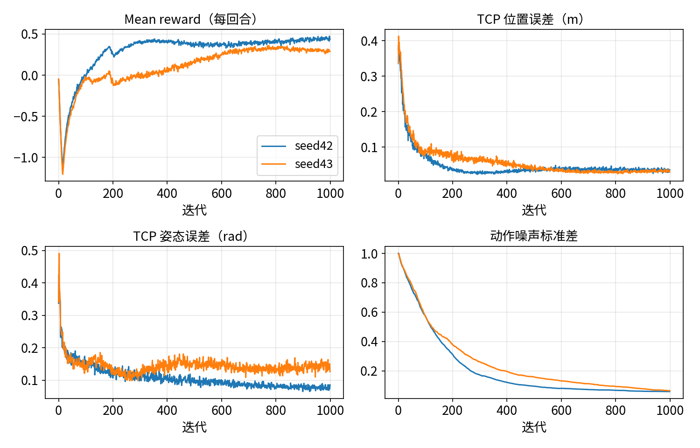

# 用 rsl_rl 训练 reach

:::{admonition} 学习目标
:class: lead-goals

- 给 `Galbot-Reach-v0` 写出 PPO 配置，并说出每一项的含义
- 在单张 12 GB 显卡上训练出第一个策略，读懂训练日志与 TensorBoard 曲线
- 判断训练是否合格，知道日志目录里有什么、怎么续训
:::

:::{admonition} 前置知识
:class: lead-prereq

- [5.3 PPO 工作流程](../../5-rl/5.3-ppo.md)：一次迭代的三段、日志各行的含义
- [6.4.1 第一个任务：单臂 reach](../4-task/6.4.1-reach.md)
:::

**本页在项目中新增 / 修改**：

- 新增 `tasks/manager_based/reach/agents/rsl_rl_ppo_cfg.py`：`GalbotReachPPORunnerCfg`；
- 修改 `tasks/manager_based/reach/__init__.py`：`Galbot-Reach-v0` 与 `-Play-v0` 加上 `rsl_rl_cfg_entry_point`；
- 修改 `tasks/manager_based/reach/reach_env_cfg.py`：右臂驱动的任务级覆盖、课程学习的终值（见"训练前对任务的两处修改"）；
- 新增 `scripts/eval_reach.py`（评估检查点）、`scripts/plot_training.py`（从日志画曲线）。

训练脚本用项目里由模板生成的 `scripts/rsl_rl/train.py`（[4.18](../../4-isaaclab/4.18-extension-template.md)）。本页训练没有域随机化的 `Galbot-Reach-v0`，它是第一个策略；加随机化的对照在 [6.5.2](6.5.2-hyperparameters.md)。

## agent 配置

这一节回答：PPO 的每个参数取多少，为什么？

配置照搬官方 `Isaac-Reach-Franka-v0` 的 `FrankaReachPPORunnerCfg`，只改实验名[^franka-ppo]。能照搬，是因为两个任务很像：动作都是 7 个关节的位置偏移，观测维数相近（Franka 32、Galbot 28），控制周期都是 1/30 s，奖励项与权重相同（6.4.1）。

| 参数 | 取值 | 含义（[5.2](../../5-rl/5.2-policy-value.md)、[5.3](../../5-rl/5.3-ppo.md)） |
|---|---|---|
| `num_steps_per_env` | 24 | 每次迭代每个环境采 24 个控制步；1024 个环境一次采 24 576 步 |
| `max_iterations` | 1000 | 总迭代数；共约 2457 万步 |
| `save_interval` | 50 | 每 50 次迭代存一个 checkpoint |
| `experiment_name` | `galbot_reach` | 日志目录名 |
| 网络 | actor、critic 各 [64, 64]，ELU | 输入 28 维，输出 7 维动作均值；任务简单，小网络够用 |
| `init_noise_std` | 1.0 | 动作初始标准差；动作 ±1 对应关节偏移 ±0.5 rad |
| 观测归一化 | 关 | 观测量级相近（关节量 ±1.5 内、目标位置 1 m 量级） |
| `learning_rate` / `schedule` | 1e-3 / adaptive | 按 KL 自动调学习率，目标 `desired_kl` 0.01 |
| `num_learning_epochs` / `num_mini_batches` | 8 / 4 | 每批数据学 8 遍，每遍分 4 个小批量 |
| `clip_param` | 0.2 | PPO 裁剪范围 |
| `gamma` / `lam` | 0.99 / 0.95 | 折扣因子、GAE 的 λ |
| `entropy_coef` | 0.001 | 熵奖励，鼓励探索 |
| `value_loss_coef` / `max_grad_norm` | 1.0 / 1.0 | 价值损失权重、梯度裁剪 |

*表 1：`GalbotReachPPORunnerCfg`（除实验名外与 Franka 相同）。*

## 训练前对任务的两处修改

这一节回答：照搬官方配置训练，结果怎样，为什么要改任务？

本站先用 6.4.1 的原样任务训练，策略最好时 TCP 误差的中位数也有约 5 cm，之后还越训越差。逐项对照后，对任务做了两处修改，诊断的全过程见 [6.5.2](6.5.2-hyperparameters.md)：

- **右臂刚度、阻尼提到 1600 / 80**。资产参数表（[6.1.5](../1-asset/6.1.5-joint-drive-tuning.md)）的 400 / 40 是"站得住、不振荡"的通用值，重力下臂会下垂约 0.08 rad，手臂伸出 0.6 m 时 TCP 就差约 5 cm。原样任务的策略在约一半的目标上"停在离目标约 5 cm 处"。刚度提到 4 倍，下垂缩小到约 1/4，这类样本几乎消失（单次对照，推断）。这个改动写在任务的 `__post_init__` 里，覆盖资产配置的执行器（[4.7](../../4-isaaclab/4.7-actuators.md)），资产参数表不动：精度要求是任务的事，别的任务可以按自己的需要再调。
- **课程学习的动作变化率惩罚只升到 −0.001**（官方 Franka 升到 −0.005）。用同一个评估脚本测官方的 `Isaac-Reach-Franka-v0`（1024 个环境），它在第 300 次迭代时误差中位数 3.3 cm，第 599 次时变成 7.3 cm，"停住但没到"的样本也从 106 个增加到 500 个，时间上与惩罚加大对得上（推断）。完全去掉这一项也不行：一个种子过线，另一个种子的手臂停不稳。

```python
# reach_env_cfg.py，GalbotReachEnvCfg.__post_init__ 中
self.scene.robot.actuators["arms"].stiffness = 1600.0
self.scene.robot.actuators["arms"].damping = 80.0
```

## 训练命令

这一节回答：怎么启动，环境数取多少？

```bash
python scripts/rsl_rl/train.py --task Galbot-Reach-v0 --headless           # 1024 个环境，1000 次迭代
python scripts/rsl_rl/train.py --task Galbot-Reach-v0 --headless --num_envs 512 --max_iterations 300 --seed 1
```

环境数默认取任务配置里的 1024（6.4.1）：主线机器 12 GB，1024 个环境时显存远未用满（[6.2.1](../2-scene/6.2.1-workbench-scene.md)），再多吞吐增长也有限。

命令行覆盖有一个坑（[4.3](../../4-isaaclab/4.3-configclass.md) 坑三）：覆盖发生在 `__post_init__` 之后，由别的字段算出来的值不会跟着变。例如用 Hydra 写 `env.decimation=2`，`sim.render_interval` 仍是 4。改时间参数时，相关字段要一起改。

## 一次完整训练

这一节回答：在 RTX 5070 上要多久，日志长什么样？

```bash
python scripts/rsl_rl/train.py --task Galbot-Reach-v0 --headless --seed 42 --run_name seed42   # run_name 只影响目录名
```

| 项 | 实测（RTX 5070，1024 个环境，种子 42 / 43 各一次） |
|---|---|
| 迭代数 / 总步数 | 1000 / 2457.6 万 |
| 墙上时间 | 1548 s / 1540 s（约 26 分钟） |
| 每次迭代 | 约 1.52 s：采集 1.47 s，更新 0.06 s |
| 每秒步数 | 约 16 000（日志的 `Computation` 行） |
| 按进程显存 | 3041 MiB |

*表 2：一次完整训练的开销。第 0 次迭代较慢（2.89 s），含初始化。*

日志每次迭代打印一段（各行含义见 [5.3](../../5-rl/5.3-ppo.md)）。开头、中段、结尾各摘几行（种子 42）：

```text
Learning iteration 0/1000
  Computation: 8495 steps/s (collection: 2.712s, learning 0.181s)
  Mean action noise std: 1.00          Mean reward: -0.05      Mean episode length: 13.55
  Metrics/ee_pose/position_error: 0.3743     Episode_Termination/time_out: 0.0321
Learning iteration 500/1000
  Computation: 15849 steps/s (collection: 1.494s, learning 0.056s)
  Mean action noise std: 0.09          Mean reward: 0.36       Mean episode length: 360.00
  Curriculum/action_rate: -0.0010
  Metrics/ee_pose/position_error: 0.0368     Episode_Termination/time_out: 1.0000
Learning iteration 999/1000
  Computation: 16135 steps/s (collection: 1.467s, learning 0.057s)
  Mean action noise std: 0.06          Mean reward: 0.44       Mean episode length: 360.00
  Metrics/ee_pose/position_error: 0.0353     Episode_Termination/time_out: 1.0000
```

- 第 0 次：回合长度只有 13.55，是因为刚开始只有少数环境结束过回合，统计还没稳定；位置误差 0.37 m，正是零动作时 TCP 离目标的距离（6.4.1）。
- 第 500 次：动作噪声从 1.0 降到 0.09，策略已经很确定；课程学习已经生效（−0.0010）；回合都以超时结束，这对 reach 是正常的。
- 第 999 次：位置误差 0.035 m。这是回合结束时、所有重置环境的**平均值**，会被少数大误差拉高；下面的评估用中位数与分位数。

## 怎么判断训练好了

这一节回答：看哪些数，什么算合格？

看三类信号：

- **Mean reward 上升后走平**：没有走平前的继续训练还有用；
- **位置误差、姿态误差下降后走平**：这是任务真正关心的量；
- **动作噪声标准差持续下降**：策略越来越确定，它接近 0 以后，再训练的收益很小。

曲线只能看趋势，合格与否用评估脚本判断。脚本跑一个完整回合，在每段目标（4 s）的最后一步记录 TCP 误差，256 个环境 × 3 段共 768 个样本：

```bash
python scripts/eval_reach.py --headless --checkpoint logs/rsl_rl/galbot_reach/<日期_时间>_seed42/model_999.pt
```

**本项目的合格线：位置误差中位数 ≤ 3 cm，且误差 < 5 cm 的样本 ≥ 80%。** 依据是官方 Franka reach 在同一评估口径下最好约 3.3 cm（上一节）；这是仿真内的指标，与真机精度无关（D-004）。

| 种子 | 中位数 | 90% 分位 | < 2 cm | < 5 cm | 姿态误差中位数 | 是否过线 |
|---|---|---|---|---|---|---|
| 42 | 2.73 cm | 6.31 cm | 32.2% | 80.9% | 0.068 rad | 过，刚好 |
| 43 | 2.91 cm | 5.80 cm | 25.5% | 83.7% | 0.142 rad | 过 |

*表 3：model_999 的评估（本站实测，按进程显存约 2470 MiB）。*

两个种子都过线，但种子 42 的 < 5 cm 比例只高出 0.9 个百分点。读者用别的种子训练，可能落在线下附近；这时先用下一节的方法挑检查点。

### 不要只用最后一个检查点

训练中每 50 次迭代存一个检查点，最后一个不一定最好。用评估脚本把几个检查点都测一遍，选最好的：

```bash
for ck in model_300.pt model_600.pt model_999.pt; do
  python scripts/eval_reach.py --headless --checkpoint logs/rsl_rl/galbot_reach/<运行>/$ck
done
```

| 种子 | model_300 | model_600 | model_999 |
|---|---|---|---|
| 42 | 2.38 cm / 94.8% | 2.95 cm / 76.0% | 2.73 cm / 80.9% |
| 43 | 4.98 cm / 50.3% | 2.61 cm / 87.1% | 2.91 cm / 83.7% |

*表 4：不同检查点的中位数 / < 5 cm 比例（本站实测）。*

种子 42 的最好检查点在第 300 次，种子 43 在第 600 次，都不是最后一个。

## TensorBoard

这一节回答：看哪几条曲线？

```bash
tensorboard --logdir logs/rsl_rl/galbot_reach          # 浏览器打开 http://localhost:6006
```

- `Train/mean_reward`：每回合平均回报；
- `Metrics/ee_pose/position_error`、`Metrics/ee_pose/orientation_error`：回合结束时的 TCP 误差；
- `Policy/mean_noise_std`：动作噪声标准差；
- `Episode_Reward/*`：各奖励项分别贡献多少，排查"某一项压过其他项"时看它；
- `Loss/learning_rate`：自适应学习率的变化。



*图 1：种子 42 / 43 的四条关键曲线，由 `scripts/plot_training.py` 从 TensorBoard 日志画出，与 TensorBoard 中的同名曲线一致。第 190 次迭代附近 mean reward 的小幅下跌，是课程学习加大惩罚造成的（4500 个控制步 ÷ 24 ≈ 187 次迭代）。*

## 日志目录与续训

这一节回答：训练产物放在哪，怎么从中断处接着训？

```text
logs/rsl_rl/galbot_reach/<日期_时间>_<run_name>/   # 不加 --run_name 时没有后缀，只有 <日期_时间>/
├── model_0.pt, model_50.pt, …, model_999.pt   # checkpoint：网络参数与优化器状态
├── params/env.yaml  params/agent.yaml          # 本次训练实际用的环境与 PPO 配置（含命令行覆盖后的值）
├── events.out.tfevents.*                        # TensorBoard 日志
└── git/                                         # 训练时代码的 git 状态（只记登记过、且是 git 仓库的，见 6.5.3）
```

续训用 `--resume`，默认接着最近一次运行的最新 checkpoint；也可以指定：

```bash
python scripts/rsl_rl/train.py --task Galbot-Reach-v0 --headless --resume --load_run <日期_时间>_<run_name> --checkpoint model_500.pt
```

`params/` 下的两份 yaml 是复现与排查时最重要的记录：它们是覆盖之后的最终值，比源码里的默认值更可信。

## 可复现性

这一节回答：同样的配置跑两次，结果一样吗？

种子相同时，同一台机器上两次训练**逐位相同**：本站用同一配置、同一种子 42 训练两次，日志与最终评估完全一致。这依赖 GPU 上的确定性计算，换显卡或驱动后不保证（[5.2](../../5-rl/5.2-policy-value.md)）。

种子不同时，差别不小：种子 42 与 43 的曲线在前 500 次迭代明显不同（图 1），最终评估的中位数相差约 0.2 cm，姿态误差差一倍（表 3）。所以报告结果时至少用两个种子，并写明种子。

## 没收敛怎么办

这一节回答：曲线不对时先查什么？

按 [5.8](../../5-rl/5.8-training-debug.md) 的顺序排查。对 reach 任务，最常见的三个原因：

1. **目标到不了**：命令范围里有一部分目标根本无法到达，平均位置误差降到某个值后就降不下去。先用 `check_reach_targets.py` 检查范围（6.4.1 表 2）。
2. **末端用错了**：拿刚体原点而不是 TCP 算奖励，策略学会的是"把手腕送到目标"（6.4.1 坑二）。
3. **非任务关节在动**：其余关节没有复位到默认姿态，躯干塌下去，目标相对手臂的位置每个回合都不同（6.4.1 坑一）。

## 常见坑

:::{admonition} 坑一：只看 mean reward
:class: warning

mean reward 是各奖励项的加权和，惩罚项的权重在课程学习中会变，它的高低不能直接说明末端到没到。判断 reach 训练得好不好，看位置误差，并用评估脚本测。
:::

:::{admonition} 坑二：拿日志里的位置误差当合格指标
:class: warning

`Metrics/ee_pose/position_error` 是回合结束时的平均值，会被少数大误差拉高（种子 42 结尾为 3.5 cm，而评估的中位数是 2.73 cm）。合格线按评估脚本的中位数与分位数来定。
:::

:::{admonition} 坑三：命令行改了 decimation，忘了它派生的值
:class: warning

`env.decimation=2` 这类覆盖不会更新 `__post_init__` 里由它算出的 `render_interval`（4.3）。改时间参数时，相关字段一起改，或者在任务配置里改。
:::

:::{admonition} 坑四：照搬官方配置就以为一定能训好
:class: warning

官方 Franka reach 的配置在同一评估口径下也会越训越差（"训练前对任务的两处修改"一节）。换一台机器人，执行器、重力下垂、课程学习都可能需要重新看；先用评估脚本建立基线，再改。
:::

## 延伸阅读

- rsl_rl 的 PPO 实现（v3.1.2）：<https://github.com/leggedrobotics/rsl_rl/blob/v3.1.2/rsl_rl/algorithms/ppo.py>
- 下一页：[6.5.2 超参数与调参顺序](6.5.2-hyperparameters.md)；回放见 [6.6.1](../6-eval/6.6.1-play-replay.md)

## 版本说明

本页基于 Isaac Sim 5.1.0、Isaac Lab 2.3.2 与 rsl_rl 3.1.2。3.0 中的情况未核对，见 [8.1 3.0 改了什么、为什么改](../../8-frontier/8.1-what-changed.md)。

3.0 的差异以 [8.6 版本追踪](../../8-frontier/8.6-version-tracking.md) 为准，本页最后核对的版本见该页核对状态表。

[^franka-ppo]: Isaac Lab `manipulation/reach/config/franka/agents/rsl_rl_ppo_cfg.py`（tag v2.3.2）：<https://github.com/isaac-sim/IsaacLab/blob/v2.3.2/source/isaaclab_tasks/isaaclab_tasks/manager_based/manipulation/reach/config/franka/agents/rsl_rl_ppo_cfg.py>
