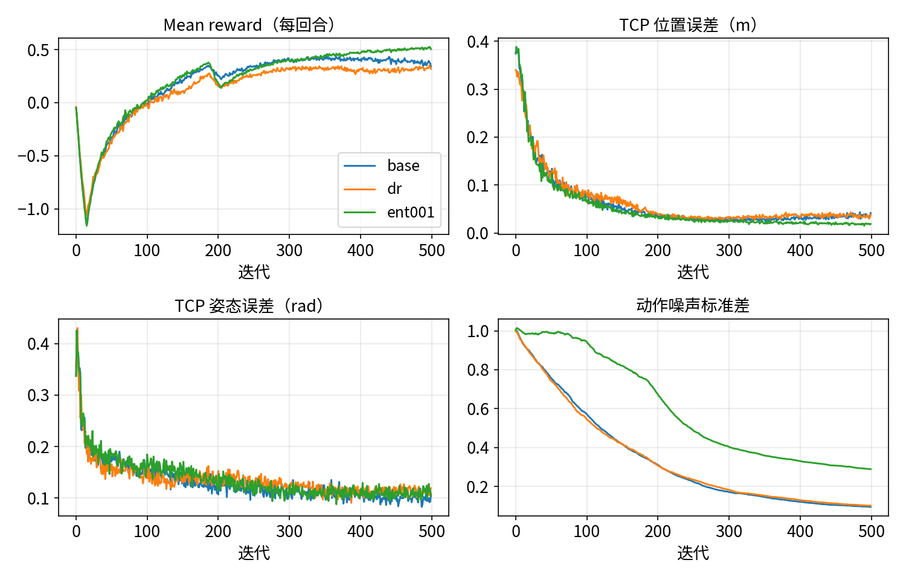
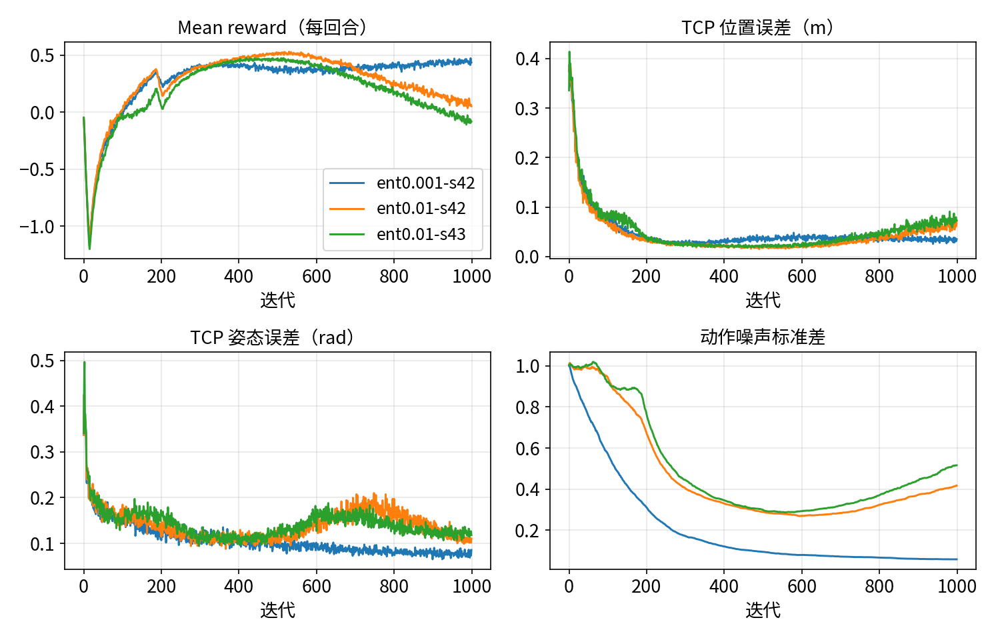

# 超参数与调参顺序

:::{admonition} 学习目标
:class: lead-goals

- 知道调参的先后：先任务，再数据量，最后算法超参，并说出理由
- 读懂一组"每次只改一个量"的对照实验，分清真实差异与运行波动
- 为 12 GB 显卡选环境数，知道哪些超参数通常不用动
:::

:::{admonition} 前置知识
:class: lead-prereq

- [6.5.1 用 rsl_rl 训练 reach](6.5.1-train-reach-rsl-rl.md)
- [5.8 训练不收敛怎么排查](../../5-rl/5.8-training-debug.md)
:::

**本页在项目中新增 / 修改**：

- 修改 `scripts/eval_reach.py`：加 `--action_scale`，评估改过动作尺度的策略；
- 修改 `tasks/manager_based/reach/__init__.py`：`Galbot-Reach-DR-v0` 与 `-DR-Play-v0` 加上 rsl_rl 入口，用于有无域随机化的对照。

## 开篇案例：照搬官方配置为什么不够

这一节回答：6.5.1 的两处修改是怎么找出来的？

6.5.1 起初原样训练 6.4.1 的任务（官方 Franka 的 PPO 配置与课程学习，右臂刚度 400）。评估口径同 6.5.1：256 个环境、每段目标末尾的 TCP 误差，768 个样本。

| 检查点 | 中位数 | < 5 cm | 停住但没到 |
|---|---|---|---|
| 第 300 次 | 4.71 cm | 54.0% | 353 / 768 |
| 第 999 次 | 8.61 cm | 16.5% | — |

*表 1：原样配置（种子 42，本站实测）。"停住但没到"指误差 > 5 cm、而最后 0.5 s 内右臂关节几乎不动的样本。*

两个现象：误差越训越大；约一半的样本是"停住了但差几厘米"，不是没走完。接下来每次只改一个量，各训练 600 次迭代：

| 只改这一项 | 第 300 次（中位数 / < 5 cm / 停住） | 第 599 次 |
|---|---|---|
| 去掉课程学习 | 5.66 cm / 36.3% / 158 | 5.91 cm / 41.3% / 127 |
| 去掉姿态奖励 | 3.04 cm / 78.0% / — | 5.29 cm / 46.2% / — |
| 学习率固定为 3e-4 | 10.00 cm / 18.4% / — | 9.82 cm / 18.2% / — |
| 右臂刚度 400 → 1600 | **2.41 cm / 94.7% / 2** | 3.38 cm / 71.6% / 190 |

*表 2：单因素对照（种子 42，单次，本站实测）。*

改刚度后，"停住"的样本几乎没有了（单次对照）：400 的刚度下，重力让臂下垂约 0.08 rad（[6.1.5](../1-asset/6.1.5-joint-drive-tuning.md)），伸出 0.6 m 时 TCP 差约 5 cm，策略没有学会补偿（推断）。后段变差仍在。为判断这是不是 Galbot 的问题，用同一评估脚本测官方 `Isaac-Reach-Franka-v0`：第 300 次 3.31 cm，第 599 次 7.31 cm，停住的样本从 106 增加到 500。官方配方本身也这样，时间上与课程学习把动作变化率惩罚加大到 −0.005 对得上（推断）。最后把这项惩罚的终值减到 −0.001，两个种子都过了 6.5.1 的合格线。

这个案例的顺序，正是下一节的顺序：先查任务（执行器、奖励、课程），最后才动算法超参（学习率）。表 2 里改学习率的一组反而最差。

## 调参顺序

这一节回答：先调什么，后调什么？

1. **任务**：奖励的项与权重、动作尺度、观测、执行器。它们决定"最优策略长什么样"，错了，算法再好也学不对。
2. **数据量**：`num_envs`、`num_steps_per_env`。决定每次更新用多少样本、训练多快。
3. **算法超参**：学习率、熵系数、网络大小。在前两项合理时，它们通常只影响快慢，很少决定成败。

先任务后算法，与 [5.8](../../5-rl/5.8-training-debug.md) 的排查顺序一致：大多数"学不会"出在任务定义上（经验性）。

## 对照实验：每次只改一个量

这一节回答：在 6.5.1 的最终配置上，单独改一个量，会怎样？

口径：基线是 6.5.1 的最终配置（种子 42，1024 个环境）。每组只用 Hydra 命令行改一项，训练 500 次迭代，评估第 499 次的检查点，评估方式同表 1。基线这一组与 6.5.1 种子 42 那次训练的前 500 次迭代**逐位相同**：两者共有的检查点参数完全一致，配置只差 `max_iterations`。所以这里的 2.87 cm 是第 499 次的值，与 6.5.1 表中第 999 次的 2.73 cm 并不矛盾。

```bash
python scripts/rsl_rl/train.py --task Galbot-Reach-v0 --headless --seed 42 --max_iterations 500 \
    --run_name scale100_s42 env.actions.arm_action.scale=1.0      # 例：只改动作尺度
python scripts/eval_reach.py --headless --checkpoint logs/rsl_rl/galbot_reach/<日期_时间>_scale100_s42/model_499.pt --action_scale 1.0
```

| 只改这一项 | 中位数 | < 5 cm | 停住但没到 | 收敛迭代 | 训练用时 | 显存峰值 |
|---|---|---|---|---|---|---|
| 基线 | 2.87 cm | 79.7% | 4 | 164 | 791 s | 3041 MiB |
| 环境数 1024 → 256 | 6.09 cm | 37.8% | 0 | — | 612 s | 2485 MiB |
| 环境数 1024 → 4096 | 5.09 cm | 49.2% | 7 | — | 1354 s | 5075 MiB |
| 动作尺度 0.5 → 0.25 | 14.07 cm | 7.6% | 28 | — | 779 s | 3041 MiB |
| 动作尺度 0.5 → 1.0 | 2.39 cm | 93.9% | 2 | 124 | 766 s | 3105 MiB |
| 精细跟踪奖励 std 0.1 → 0.05 | 3.86 cm | 69.5% | 0 | 494 | 784 s | 3041 MiB |
| 精细跟踪奖励 std 0.1 → 0.2 | 4.36 cm | 56.9% | 37 | — | 781 s | 3041 MiB |
| 熵系数 0.001 → 0.01 | 1.38 cm | 100.0% | 0 | 146 | 784 s | 3041 MiB |
| 加域随机化（6.4.2） | 2.99 cm | 89.3% | 0 | 186 | 787 s | 3041 MiB |

*表 3：单因素对照（种子 42，单次，本站实测；RTX 5070 12 GB，显存按进程计）。"停住但没到"的分母是 768。"收敛迭代"是训练日志中位置误差的 20 次滑动平均从此一直低于 5 cm 的迭代，"—"表示 500 次内没有做到。这个量对种子很敏感：基线种子 42 为 164，种子 43 为 433，熵系数 0.01 的两个种子为 146 与 191。*

先看波动有多大：同一配置换成种子 43，基线是 3.30 cm / 78.8%，与种子 42 的 2.87 cm / 79.7% 相比，中位数差约 0.4 cm。差距在这个范围以内的，只能说"无显著差异"。

**环境数。** 迭代数固定时，换环境数会同时改变样本数（每次迭代采 环境数 × 24 步），所以这组**不是公平对比**，只能说明"500 次迭代够不够"：

- 256 个环境样本只有基线的 1/4，误差翻倍；
- 4096 个环境样本是 4 倍，结果反而比基线差，用时是 1.7 倍，显存是 1.7 倍。

这是单种子的观察，原因未查。显存与吞吐见下一节。

**动作尺度。** 0.25 时误差是基线的 5 倍，"停住但没到"的样本有 28 个。1.0 时中位数 2.39 cm、< 5 cm 93.9%，比基线好，但中位数差距只略大于种子间的波动。推断：尺度小时，同样的网络输出只能让关节走一半远，到达远处的目标更难。

**精细跟踪奖励的 std。** 改成 0.05 或 0.2 都比 0.1 差。0.2 时"停住但没到"有 37 个：核函数太宽，离目标 3–5 cm 与正好到达拿到的奖励差不多，策略缺少走完最后一段的动力（推断）。



*图 1：基线（base）、域随机化（dr）与熵系数 0.01（ent001）的训练曲线（种子 42，`scripts/plot_training.py`）。*

**熵系数。** 这是唯一明显更好的一项，而且两个种子都复现了：

| 熵系数 | 种子 42 | 种子 43 |
|---|---|---|
| 0.001（基线） | 2.87 cm / 79.7% | 3.30 cm / 78.8% |
| 0.01 | 1.38 cm / 100.0% | 1.65 cm / 99.9% |

*表 4：熵系数的两个种子（中位数 / < 5 cm）。*

训练曲线上，熵系数 0.01 时动作噪声标准差在第 499 次约 0.29–0.30，基线是 0.10–0.16。策略保持了更多的探索，没有过早收敛到"差几厘米"的动作（推断，依据是噪声曲线与评估结果）。评估时用的是动作均值（[5.2](../../5-rl/5.2-policy-value.md)），噪声大不影响评估。两个种子的结论仍只写"观察到"，而且只在 500 次迭代内成立：训满 1000 次后的结果见本节末尾的"训练预算与消融结论"。

**域随机化。** 6.4.2 的随机化（质量、增益、关节参数，加观测噪声）在无随机化的任务上评估：中位数 2.99 cm，与基线在波动范围内，< 5 cm 为 89.3%。换到带随机化的任务上评估（训练用的 `Galbot-Reach-DR-v0`，256 个环境）：

- 基线策略 3.16 cm / 78.4%；
- 随机化训练的策略 3.09 cm / 86.1%。

这一组也是单种子：随机化训练没有让无随机化时的表现变差，在随机化环境里 < 5 cm 的比例高约 8 个百分点。它对真机是否有帮助，要到 [6.7.3](../7-deploy/6.7.3-sim2real-checklist.md) 才能讨论。

**结论。** 6.5.1 的配置已过合格线，主线保持熵系数 0.001（D-028）。熵系数 0.01 在 500 次迭代内明显更好，训满 1000 次就退化（见下一小节"训练预算与消融结论"）。要用它，需要配合更短的训练预算，或者让熵系数随训练逐渐减小；后一种做法本站没有验证。动作尺度 1.0 在 500 次内略好，同样只在这个预算内测过。

### 训练预算与消融结论

这一小节回答：500 次迭代里明显更好的配置，训满 1000 次还好吗？

不一定。熵系数 0.01 在两个种子上都远好于基线，于是本站按主线的预算（1000 次迭代，同 6.5.1）重训了两个种子，再评估第 300、600、999 次的检查点：

| 熵系数 | 种子 | 第 300 次 | 第 600 次 | 第 999 次 |
|---|---|---|---|---|
| 0.001（主线） | 42 | 2.38 cm / 94.8% | 2.95 cm / 76.0% | 2.73 cm / 80.9% |
| 0.001（主线） | 43 | 4.98 cm / 50.3% | 2.61 cm / 87.1% | 2.91 cm / 83.7% |
| 0.01 | 42 | 1.82 cm / 99.9% | 1.58 cm / 100.0% | **5.59 cm / 45.2%** |
| 0.01 | 43 | 1.89 cm / 99.9% | 1.85 cm / 99.2% | **6.45 cm / 37.5%** |

*表 5：1000 次迭代下的检查点对比（中位数 / < 5 cm，本站实测；0.001 两行即 6.5.1 的训练）。合格线为中位数 ≤ 3 cm 且 < 5 cm ≥ 80%。*



*图 2：主线配置（ent0.001，种子 42）与熵系数 0.01（两个种子）训练 1000 次的曲线（`scripts/plot_training.py`）。*

熵系数 0.01 的两个种子前 600 次都很好，之后同时变差：动作噪声标准差在第 600 次前后降到最低（约 0.27 与 0.29），然后回升到 0.42 与 0.52；奖励一路下降，第 999 次的检查点不合格。主线的 0.001 没有这个现象，噪声一直下降。

推断的机理：熵奖励鼓励策略保持随机，跟踪奖励则要求它准。训练后段，末端已经离目标很近，跟踪奖励能再提高的空间很小，固定大小的熵奖励就占了上风，把策略推向更随机，动作均值也随之变差。这一点没有做对照实验验证。

教训：**消融的训练预算要与正式训练一致。** 本页的对照都只训练到 500 次，正好停在退化开始之前，"熵系数 0.01 更好"只在这个预算内成立。

## 12 GB 显卡选多少个环境

这一节回答：环境数的上限在哪，选多少合适？

| 环境数 | 显存峰值 | 每次迭代 | 吞吐（环境步 / s） |
|---|---|---|---|
| 256 | 2485 MiB | 1.20 s | 5.1 k |
| 1024（主线） | 3041 MiB | 1.49 s | 16.5 k |
| 4096 | 5075 MiB | 2.63 s | 37.4 k |
| 8192 | 7627 MiB（显存放得下） | 4.52 s | 44.9 k（只跑了 5 次迭代） |
| 16384 | 显存不足，训练失败 | — | — |

*表 6：Galbot reach 在 RTX 5070 12 GB 上的显存与吞吐（本站实测，显存按进程计；吞吐取训练日志中最后 50 次迭代的平均，8192 只跑了 5 次迭代）。16384 时，PhysX 先报 `Patch buffer overflow`，随后 CUDA 显存不足，进程约占 11.1 GB 后退出。*

- **显存**的上限在 8192 与 16384 之间：8192 时显存 7.6 GB，放得下；16384 显存不足。
- 但 8192 时的瓶颈是**主机内存**，不是显存。本站主机内存 16 GB。校验方复跑 8192 时，仿真启动阶段主机可用内存降到约 1.6 GB，被内存保护停掉，没有进入第 1 次迭代（实测）。本站那次跑通时没有记录主机内存。能否训满，取决于机器当时其他进程占了多少内存。1024 个环境时，训练进程的主机内存峰值约 5.9 GB（6.5.1b 实测）。
- 吞吐随环境数增长，但越来越慢：从 4096 到 8192，环境翻倍，吞吐只多 20%。这与 [5.4](../../5-rl/5.4-parallel-envs.md) 所说"GPU 被占满后，吞吐不再线性增长"一致（推断）。
- 主线用 1024：显存余量大，单次迭代快，便于反复试验。表 3 中的 4096 在 500 次迭代内也没有更好。

显卡显存与可选环境数的一般关系见 [1.3](../../1-env/1.3-hardware.md)。

## 通常不用动的

这一节回答：哪些超参数可以放心用默认值？

`agents/rsl_rl_ppo_cfg.py` 里的算法超参照搬官方 Franka reach。下面几项在 Isaac Lab 自带的各种 rsl_rl 任务里取值大致相同，本页的对照没有动它们（经验性，各项含义见 [5.3](../../5-rl/5.3-ppo.md)）：

| 参数 | 本项目取值 | 什么时候才考虑改 |
|---|---|---|
| `gamma` | 0.99 | 任务需要看得很远（几十秒后才有回报）时调大 |
| `lam` | 0.95 | 一般不动 |
| `clip_param` | 0.2 | 一般不动 |
| `num_learning_epochs` / `num_mini_batches` | 8 / 4 | 环境数变化很大，每个小批次的样本数随之大变时 |
| `desired_kl` | 0.01 | 配合 `schedule="adaptive"` 使用，见下文"常见坑" |
| `max_grad_norm` | 1.0 | 一般不动 |

*表 7：通常不用动的超参数。*

网络大小（`[64, 64]`）对 reach 这种 28 维观测、7 维动作的小任务够用。换成接触多、观测大的任务再考虑加大（经验性）。

## 记录实验

这一节回答：怎么记，才能回头看得懂？

每次训练记下面这几栏，放在实验目录旁边的一张表里。[6.5.3](6.5.3-experiment-management.md) 会讲怎样让日志目录自动带上这些信息。

| 运行名 | 日期 | 代码版本（git commit） | 改了什么（相对基线） | 种子 | 迭代数 | 评估结果（中位数 / < 5 cm） | 结论 |
|---|---|---|---|---|---|---|---|
| base_s42 | 2026-10-08 | 本站仓库工作区（未提交） | 无 | 42 | 500 | 2.87 cm / 79.7% | 基线 |
| scale025_s42 | 2026-10-08 | 同上 | 动作尺度 0.5 → 0.25 | 42 | 500 | 14.07 cm / 7.6% | 明显变差，不采用 |

*表 8：实验记录模板，前两行取自表 3。代码版本一栏应填 git commit；本站这批对照是在未提交的工作区上跑的，所以只能写"工作区"，这正是 [6.5.3](6.5.3-experiment-management.md) 要解决的问题。*

要点：

- **"改了什么"只写一项**。同时改了两项，结论就分不开；
- **用命令行覆盖，不改文件**：如 `env.actions.arm_action.scale=0.25`，这样同一份代码能跑全部对照，覆盖值本身就是记录；
- **评估结果用固定的评估脚本**：本项目一律用 `eval_reach.py`，固定 256 个环境、种子相同。训练曲线上的奖励不能跨运行比较（见"常见坑"）。

## 常见坑

:::{admonition} 坑一：单次运行的差异当真
:class: warning

同一配置换个种子，结果差多少？6.5.1 的最终配置在第 300 次迭代时，种子 42 的中位数是 2.38 cm，种子 43 是 4.98 cm；到第 999 次分别是 2.73 cm 和 2.91 cm（本站实测）。训练前期的差距可以比改超参带来的差距还大。两组对照的差距小于种子间的差距时，只能说"无显著差异"。
:::

:::{admonition} 坑二：拿奖励曲线比较两次运行
:class: warning

课程学习会在训练中途加大惩罚项（本项目在 4500 个控制步后），奖励曲线随之下跌，这与策略变好变坏无关。改奖励权重、`std` 也会改变奖励的尺度。比较两次运行要看任务指标，即 TCP 误差（`Metrics/ee_pose/position_error` 或评估脚本），不要看 mean reward。
:::

:::{admonition} 坑三：改了学习率，其实没改
:class: warning

`schedule="adaptive"` 时，`learning_rate` 只是初始值。rsl_rl 每次更新时按 KL 散度调整学习率：大于 `2 × desired_kl` 就除以 1.5，小于 `desired_kl / 2` 就乘以 1.5[^adaptive]。6.5.1 的原样配置训练到约 400 次迭代后，学习率已降到接近 1e-5（本站实测）。要真正固定学习率，需同时设 `schedule="fixed"`。
:::

:::{admonition} 坑四：训练和评估的动作尺度不一致
:class: warning

动作尺度属于环境配置。用 `env.actions.arm_action.scale=0.25` 训练出的策略，评估时如果用默认的 0.5，同一个网络输出会让关节走两倍远，结果毫无意义。本页给 `eval_reach.py` 加了 `--action_scale`，评估时必须与训练一致。
:::

:::{admonition} 坑五：消融的训练预算比正式训练短
:class: warning

本页的对照都只训练 500 次，熵系数 0.01 在两个种子上都更好；按正式预算训满 1000 次，两个种子的最终检查点都不合格（表 5）。对照的迭代数要与正式训练相同；预算不同时，结论只能写"在 N 次迭代内"。
:::

## 延伸阅读

- 下一页：[6.5.3 实验管理与复现](6.5.3-experiment-management.md)；回放见 [6.6.1](../6-eval/6.6.1-play-replay.md)

## 版本说明

本页基于 Isaac Sim 5.1.0、Isaac Lab 2.3.2 与 rsl_rl 3.1.2。3.0 中的情况未核对，见 [8.1 3.0 改了什么、为什么改](../../8-frontier/8.1-what-changed.md)。

3.0 的差异以 [8.6 版本追踪](../../8-frontier/8.6-version-tracking.md) 为准，本页最后核对的版本见该页核对状态表。

[^adaptive]: rsl_rl `algorithms/ppo.py`（v3.1.2）自适应学习率：<https://github.com/leggedrobotics/rsl_rl/blob/v3.1.2/rsl_rl/algorithms/ppo.py#L259-L292>
